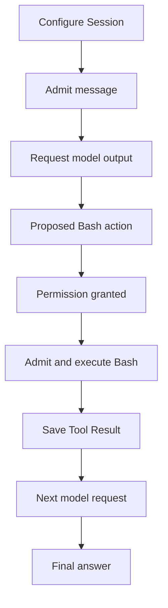
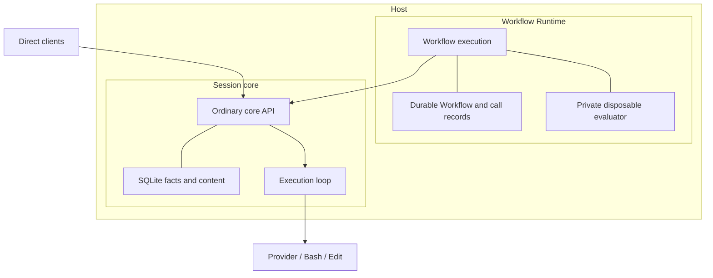
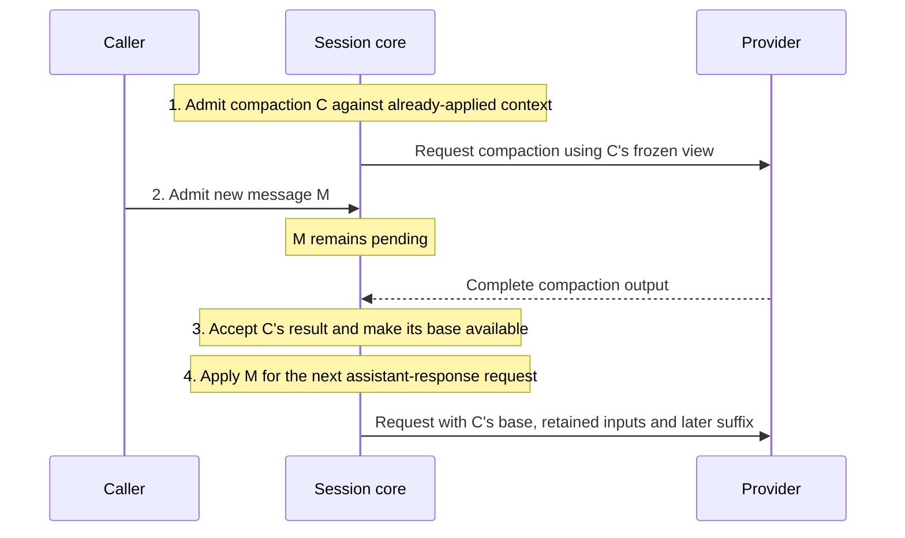
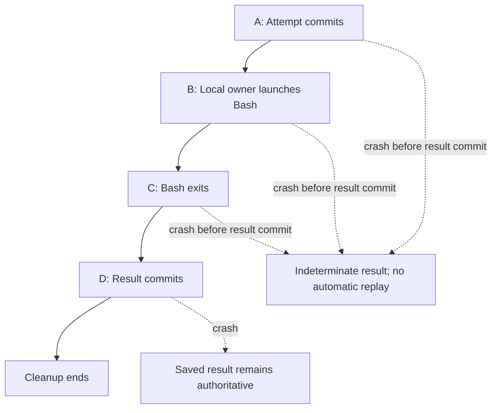

# Rui architecture

This is the accepted V1 contract, not implementation evidence. [README.md](README.md) owns product/status; [VERIFICATION.md](VERIFICATION.md) owns required evidence.

## A piece of work from start to finish

Suppose a caller wants an agent to investigate a failing test. The caller explicitly starts the Host, names a Session, configures its Workspace and sends a message. The model asks to run Bash. With the default permission mode, Rui saves the proposed action and asks for approval. Once approved and admitted for execution, Bash runs; Rui saves its result and asks the model for the final answer.

The caller can disconnect while this work continues. If the Host instead crashes during Bash, recovery reports an indeterminate tool result: the command may have run, so Rui does not automatically run it again. The model can investigate through fresh calls. The sections below define the exact admission, permission and recovery boundaries behind this example.

Read sequentially or jump to the owning contract:

- [Owners and identities](#owners-and-identities): who owns conversations and workflows.
- [Admission](#admission-and-public-requests) and [conversation/settings](#conversation-and-current-settings): configure, submit and recover replies.
- [Model requests](#model-requests-continuation-and-compaction): freeze inputs, retain output and compact context.
- [Tools and permission](#model-output-tools-and-permission), including [Exact Edit](#exact-edit).
- [Execution and recovery](#transactions-execution-and-recovery), then [stops and outcomes](#stops-and-terminal-outcomes).
- [Workflows](#workflow-evaluation-and-cancellation) and their [evaluator containment](#evaluator-containment).
- [Inspection and local protocol](#inspection-and-local-protocol): observe, wait and control work.
- [Host lifetime/platforms](#platforms-and-server-lifetime) and [resources/storage](#resources-storage-and-diagnostics).
- [Remaining decisions](#remaining-decisions): implementation choices and qualification still outstanding.

## Owners and identities

The explicitly started **Host** server contains **Session core**, owning conversations/execution, and **Workflow Runtime**, owning workflow execution through the ordinary core API. Runtime’s private disposable JavaScript evaluator computes requested calls from supplied facts.

Core and Runtime transact independently and never read each other’s tables. They may share a Store/process; database-file count is unspecified. Runtime uses ordinary core admission, without shared caller/core transactions. This requires saved intents, idempotent resubmission and separate answer recording, accepting cancellation’s submit-before-stop window. Independent transactions do not isolate canonical storage faults: those fence the Host.

The **Host Store** contains canonical facts/content. The **Storage Owner** exclusively accesses core tables. **Content References** identify complete immutable bytes with length/digest and bounded reads. Credentials and diagnostics cannot determine semantic recovery.

| Term | Meaning |
| --- | --- |
| Local Owner | The server/Store owner. All admitted clients act for it; no per-client ACL, delegated Principal or exclusive Session ownership exists. |
| Caller / User / Agent | A Caller invokes APIs; User is the message role, whether person or agent; Agent is the model-driven decision-maker. These roles confer no additional authority. |
| Session / Session reference | One reusable linear conversation, Workspace and access scope. Its opaque caller-provided key addresses it within a Store. Sessions have no terminal outcome or persisted lifecycle phase. |
| Workspace | Working-directory context for relative tool paths, not a sandbox or allowed-path boundary. |
| Turn | Work from taking one or more queued User Messages for processing through a Final Answer or typed terminal outcome. At most one Turn is nonterminal per Session; callers need no Turn key. |

Each fact has one authority; each resident allocation has an owner, bounded population and release boundary. Core drives Session progression; Runtime drives workflow evaluation, saved submissions and cancellation through ordinary core calls. Their Host-facing driving interfaces are private; clients do not sequence transactions, dispatch or recovery. Use direct transactions and deep effect modules. Native embedding and Cloudflare Durable Objects are design probes, not SDK/ABI/deployment commitments. Abstractions need concrete consumers or invariants.

## Admission and public requests

### Names, references, IDs and idempotency keys

| Term | Meaning |
| --- | --- |
| Name | Caller-chosen stable text within a documented scope. Session names are local to a Workflow; submission names are local to a Session within a Workflow. These are not freely editable display labels: changing a name can select different work. |
| Reference | Complete value used to address an object. A Session reference is an opaque string such as `workflow/42/reviewer`, not a live handle or lookup operation. |
| ID | Runtime-assigned identity of a durable object, such as Store-wide Workflow ID `42`. Representation and allocation belong to the object's owner. |
| Idempotency key | Identifies a submission across retries so its original committed answer can be recovered. The caller supplies a Workflow creation idempotency key; direct core callers supply a core idempotency key, while Workflow Runtime saves one generated UUIDv4 with each durable submission intent. This does not promise exactly-once external effects. |
| Label | Non-identifying descriptive text. No new label field is introduced. |

Use these qualified terms consistently; do not use a tracing request ID as an idempotency key or confuse a local name with its full reference. The saved core token and the author's submission name serve different boundaries; authors do not generate or encode core tokens.

### Naming and configuring a Session

Clients construct Session references locally, without existence checks, core calls or generated-ID discovery. They unambiguously encode their namespace and local name; core treats the complete reference as opaque, without direct/workflow categories. Equal full references select the same Session across clients. Reuse passes the existing reference unchanged, without another namespace prefix. Workflow `session(name)` scopes names by Workflow identity: replay retains the reference; a fresh Workflow differs. Namespaces separate names, not authority; possessing a reference grants no access.

The first complete valid configuration for an unknown Session reference atomically establishes Session, baseline, Workspace, access scope and request answer.

Later configurations apply supplied mutable fields in admission order; omitted fields remain unchanged. Enforce immutable Workspace/access constraints and supported Core values, without initial-baseline equality comparisons. Provider/model compatibility is evaluated for the frozen model Operation rather than at configuration admission.

Incomplete initialization and messages to unknown Session references reject without partial Sessions. Message admission validates the command and immutable content without provider I/O; acceptance guarantees valid canonical Conversation input if the message is later selected. Configuration enqueues no message; any previously queued input remains governed by the queue invariant when changed settings make it resumable.

No separate creation, reservation, attachment or must-be-new operation is selected.

### Recovering a submission after a lost reply

A **core idempotency key** is a caller-provided value binding one state-changing caller command to core, complete inputs and original committed admission answer: acceptance or definite rejection. Message acceptance identifies one immutable admission to the Session queue; it need not identify a Turn yet. The [processing boundary](#conversation-entries-and-pending-messages) establishes the message's result binding once. Distinct messages processed in one Turn share its result.

Every state-changing caller command to core requires a stable core idempotency key: configuration, message submission, Session stop, Permission Decision and exact Model Interruption. Once committed, its inputs, admission-time selection and original admission answer never change; retries recover that decision rather than select new work. This gives callers one lost-reply recovery rule across intervening work and crashes. Reads and waits observe current facts without retained command identities. Internal driving and effect evidence retain their existing Operation/Attempt authority; this rule does not authorize replay of uncertain effects.

All callers share one Store-wide core idempotency-key domain. Atomically bind the key, target, operation kind, complete canonical inputs and original acceptance/definite rejection with the mutation. Target and kind are bound inputs, not lookup scope; changing either or the inputs conflicts. Recovery requires authorization; a key grants no access.

Core requires an exact UTF-8 string of at most 128 bytes and does not interpret or validate UUID syntax. An empty supplied string remains an identity, not a request to generate one. Runtime and client helpers default to lowercase, hyphenated UUIDv4 text (36 ASCII bytes), generated with platform cryptographically secure randomness. Core enforces bindings rather than assuming tokens are unique; separate clients choosing the same string share one identity.

Recover matching admission answers before checking current conditions; changed inputs conflict without replacement. Every new command needs a fresh key, even with equal inputs. V1 accepts securely generated UUIDv4’s probabilistic uniqueness: core detects mismatched reuse but cannot distinguish a retry from a new command with the same key and inputs.

Retrying old configuration cannot revert later settings; retrying a message recovers the same admission, without enqueueing it again, changing an established result binding or reviving excluded input. An unbound admission remains the same queued work until core takes it for processing. A rejection before Session initialization remains rejected afterward.

Typed results distinguish committed acceptance/rejection, proven key conflict, and failure to establish a trustworthy answer. Conflict preserves the original binding. Invocation/storage failure, malformed envelopes without usable identity and failed commits cannot claim a saved rejection or answer.

Acknowledgment follows durable commit, without provider dispatch or final-answer delay. Configuration completes at admission. Message acceptance completes queue admission; processing and the final result may remain pending.

Observation by core idempotency key returns absent, original rejection, or original acceptance with command-specific progress/completion. For messages this includes queued status, established processing binding/result or stop/cancellation exclusion; for stops it follows the saved selection. Later processing facts do not rewrite the original admission answer. Scalar observations suffice; batching is optional. Wait/read correctness cannot require every notification. Direct clients durably retain destination Store identity, operation, exact key and captured inputs before transmission for restart recovery; immutable retained content references may replace inline payloads, but mutable source paths or digests alone cannot. Helpers reuse that record rather than generate a new token on retry. In-memory retention supports only retries while the client survives. Uncertain replies are recovered with the saved identity, not guessed from content.

Direct caller capture enforces the decoded per-value content boundary while streaming, before publication or transmission. A stable OS-held lock per record owns capture, recovery and no-overwrite publication. Revisiting that record removes its prior incomplete temporary under the lock; killing a writer releases the lock. The empty lock file remains to preserve one lock inode across openers. This does not reclaim captures at abandoned distinct record paths or legacy PID-named temporaries. A complete published record survives a subsequent directory-sync failure and remains available for recovery.

Runtime saves exact submission identity, captured inputs and one UUIDv4 in its existing intent transaction before core invocation, then records the answer independently; resubmit with that immutable token after lost replies. Core knows no Workflow membership/cancellation. This provides recoverable admission, not exactly-once effects. Controls use the same saved-key protocol; their owners retain command-specific validation, target selection and completion semantics. An original acceptance is immutable even while its completion progresses. A fresh key requests a fresh decision against current state; it does not override an already-settled target.

Retain authoritative intents, retry bindings and content required for original-answer recovery without independent expiration in V1, including after terminal completion. Storage exhaustion cannot silently discard recovery history. This recovery contract assumes committed authoritative history survives; independent database rollback, Store replacement or loss of one owner's history is not ordinary crash recovery. Detectable missing/corrupt authoritative state must not be treated as fresh work.

### Example: acceptance and answer arrive separately

A caller submits “Investigate the failing test” with core idempotency key `message-1`. Core commits acceptance, but the connection closes before the reply arrives. Resending the same identity and inputs recovers that acceptance and its original work; it does not submit another message. The final answer may still be pending. Even after the Session has done newer work, `message-1` remains bound to its original result. A deliberate second submission uses a new identity.

The [workflow identity example](#example-conversation-workflow-and-call-identities) shows how Runtime supplies these identities for workflow calls.

## Conversation and current settings

### Conversation entries and pending messages

**Conversation** is the immutable ordered history of User text, assistant text, Tool Calls, Tool Results and System Instructions. Each entry records its exact causal source and applicable Turn. No edit, deletion or compaction rewrites history. An admitted User Message and its Conversation entry are distinct: **projection** means appending the admitted message to this history. Admission can precede projection, as the pending-message rules below specify.

Messages are immutable admissions ordered within their Session. An admission waiting for processing has no result-producing Turn binding. When no Turn is active, core takes the queued admission-order prefix to begin a Turn; admission of new input may perform that transition in the same transaction. The oldest selected message initiates the Turn. During active work, later admissions wait for its next input boundary without changing Conversation or a frozen model request.

At an input boundary, select all eligible pending messages through the observed admission cutoff. One transaction rechecks selection eligibility, stop authority and the parent Turn, then binds that prefix to the processing Turn, appends its Conversation projections and admits the next assistant-response model Operation with its manifest. A saved stop cannot be overwritten by late selection. Rollback commits none of the binding, projections or Operation. Input beyond the selected cutoff remains queued. Binding is established once: the message observes that Turn's final text, schema-validated value or typed failure. It is never rebound or automatically requeued after processing. Stop/cancellation may instead exclude an unselected admission and provide its cancelled result through the controlling fact, without inventing a Turn.

**Queue invariant:** eligible queued input or a completely settled Tool Call group awaiting model continuation makes a resumable Session runnable, without requiring another message. Eligible input is admitted, unselected and not excluded by stop/cancellation. Resumability requires the ordinary continuation and effect-settlement preconditions; queue presence or terminal coverage grants no bypass. Core discovers this work from committed facts after admission, input boundaries, terminal settlement, prerequisite changes and restart, even if a notification is lost. With usable capacity it eventually admits some eligible work; a finite, non-replenished workload drains when prerequisites become satisfied and admitted lifecycles finish and release capacity. This promises no cross-Session winner order, individual wait bound or starvation freedom under indefinitely replenished competition. Unavailable capacity retains work without execution resources or a spin loop. A blocked prerequisite leaves input queued; an admitted Operation failure settles selected input through its Turn, while a required canonical failure follows the shutdown boundary. Runnable state is derived, not a persisted Session phase, wake receipt or per-Session worker.

This rule covers arrivals before/after failure and recovery without a later caller wake: an [invariant-based simplification](https://matklad.github.io/2023/10/06/what-is-an-invariant.html) with finite-drain progress rather than winner order as its scheduling guarantee.

Compaction uses already-applied context and leaves pending messages alone. No model-created conversational Input Request exists; permission decisions are separate control facts, not messages. Successful settlement requires no pending applicable message, actionable permission, unresolved Operation or admitted effect, and atomically releases occupancy.

### Selecting current settings

A **Session Context Revision** records persistent configuration selected by sparse caller updates; its private storage representation is an implementation choice. Component kinds are model binding, instructions, Tool Catalog, context policy, reasoning defaults, optional output schema, Permission Mode and default output limits. Sharing a configuration revision does not give these components one application boundary: model inputs are selected at model Operation admission, while Permission Mode is action-authorization policy selected at child Action admission. Resource limits follow their owning execution or resource scope. This distinction requires no separate settings store or applied-state machinery. Supported Session settings are mutable unless a change would alter Session identity or Workspace/access scope. Validate supported Core values atomically. Provider compatibility requires adapter evidence for the exact frozen Operation; it cannot reject canonical configuration or redefine Conversation membership. Host settings remain outside Session configuration under their startup rules. This rule does not add new supported fields or provider capabilities.

First configuration requires an explicit model and Workspace. Omitted instructions default to empty text, omitted tools offer Bash and Edit, omitted Permission Mode selects `ask`, and absent Output Schema selects text answers. An explicit empty tool list offers no tools. Apply these defaults only when establishing the Session; later omitted fields preserve their existing values. Explicit `instructions: ""` selects empty instructions, `tools: []` offers no tools, and `outputSchema: null` clears the schema to select text answers. Omission never clears a field. Settings are ordinary reusable JavaScript data: each configure invocation captures its inputs before later caller mutation, and each Session's configuration evolves independently. Sharing a settings object creates no shared configuration entity.

New requests select one committed revision and resolve settings at or before it. No Turn-wide configuration copy, temporary override layer, cross-call lock or historical revision precondition exists. Configuration and subsequent messages can interleave with other clients; later message failure does not roll back configuration.

Queued messages do not capture model settings at message admission. At the next assistant-response input boundary, selected messages use the effective model context selected for that request. For example, while a request is active, admit “review this code,” then configure “focus on security”: if that configuration commits before the next request's selection boundary, the queued review uses it. A configuration committed after that boundary affects later requests; it cannot alter the admitted Operation or its replacement Attempts. Instruction updates remain ordered canonical Conversation facts under the rule below. This model-input boundary does not define when action permission policy changes take effect; authorization follows its own contract.

### Recording and rendering instruction updates

Every successfully admitted explicit instruction update appends an immutable System Instruction to the canonical Conversation, including intermediate reversals and fresh equal values: A→B→A records B and the second A; A→A is an update. Matching request replay adds nothing; omitting instructions creates no update. Identical bytes may share content storage without collapsing distinct entries.

At model Operation admission, core freezes the canonical historical boundary and effective instructions selected for that Operation. The provider adapter owns provider- and model-specific projection of those immutable facts. It may append one wire block per entry, coalesce or lower entries, or use another supported representation, provided the resulting request preserves effective instruction authority and canonical history remains unchanged. No universal wire-block count or placement is a core guarantee.

Commit each configuration revision and its explicit instruction entry atomically. Rollback appends neither. Operation admission and replay derive from canonical originating-update references and the initial baseline, including compaction-covered entries, not text equality or a separate queue/applied flag/receipt. Already-admitted Operations and replacement Attempts retain their frozen historical view; later configuration cannot rewrite it.

With unchanged adapter rules, reconstruction produces equivalent provider input. A deliberate adapter-rule change may alter provider rendering from the same canonical facts without changing their authority, the Operation boundary or Conversation. Adapters should preserve stable provider prefixes where supported, but provider cache layout does not redefine canonical history.

Model-visible time/date/timezone/Workspace binds the adapter's immutable instruction rendering for the admitted Operation; tool observations belong to results. No automatic polling/clock refresh or Turn-environment reconstruction on retry.

### Text and structured answers

An optional persistent **Output Schema** selects a model-generated structured Final Answer; absence selects text. The producing request freezes it. The adapter translates to a supported provider mechanism and validates response/schema in the bounded validation path; workflows receive that value without a second interpretation. Unsupported schemas, refusal, incomplete generation and invalid output fail explicitly. No prose conversion, repair call, per-caller schema or reinterpretation under later settings is permitted.

## Model requests, continuation and compaction

### Operations and frozen requests

An **Operation** is one model request or Action, owning its exact descriptor, causal source and current execution/retry facts. Its optional **Resolution** is its immutable final result; the Operation ID also identifies that result. A retry is another [Attempt](#admitting-an-attempt) of the same Operation; a model request admitted against new context or settings is a new Operation.

Each model Operation owns one immutable **Model Request Manifest** binding its protocol operation, requested concrete model, historical Session settings and input view, reasoning/output limits and output contract. References/digests identify canonical content; runtime facts retain their original rendering references. Session facts and Operation admission share one committed per-Session order on their owning records, without a duplicate payload log. The Operation's admission position fixes its historical boundary. Accepted model output, call rejection and Action Resolution become available at their acceptance positions, not a producing Operation's earlier admission position. Historical visibility does not bypass pending-input applicability, expose an incomplete Tool Result group or change Conversation/tool-call order.

Replacement Attempts retain that historical view. With unchanged adapter rules, they reconstruct equivalent request semantics; meaningless JSON spelling need not match. The caller may deliberately change adapter selection/rendering rules between Attempts, so identical requests across such a change are not promised. This does not mutate historical Session settings, provider binding, output contract, saved effect authorization or retry accounting, or permit unsupported continuation. No frozen adapter implementation/version is required. Credentials, endpoints, sockets, transport and nonsemantic headers remain late-bound.

### Retaining accepted output

Retain accepted model output losslessly in provider order as immutable **Model Output Items** owned by the resolved Operation. Store semantic, private continuation and required response-evidence fields once with producing request/Attempt provenance. Commit Resolution, items and applicable Conversation projections atomically. Derive replay input by stripping response-only/non-replayable fields; persist neither a second replay copy nor a serialized request body. Preserve unknown open fields within known items. Private reasoning, encrypted material, signatures and compaction items remain opaque and inaccessible through generic content reads.

Unknown consequential discriminators—item, content block, Action subtype, compaction variant or terminal status—produce `unsupported_provider_output` with bounded typed rejection and necessary request/causal provenance, without Conversation, continuation or effects. Complete rejected payloads are optional diagnostic detail, not mandatory permanent history. Raw HTTP/SSE framing, token deltas and partial/interrupted/late output remain scratch, never continuation authority.

### Choosing and validating compacted context

**Model Context** is an optional selected Compaction Base followed by one complete ordered suffix of canonical host input and accepted model Operation results, with the binding-specific retained inputs below. A **Compaction Base** is the derived role of an accepted compaction result selected within a later Operation's view. Its producing Operation's admission position is the covered frontier: compaction uses that Operation's historical view, and later applicable inputs form the suffix. The result's ownership identifies this boundary without a separate input list or coverage record. Derive prior bases within that view; retain no copied request body, checkpoint row or permanent history of failed Attempts. Provider caches/previous-response IDs are optional only when their loss permits local reconstruction.

User Messages have no token-admission quota and are never silently split or truncated. The configured **Compaction Trigger** estimates pressure, anchoring on provider usage where available and estimating newly appended content; it is not a content ceiling. Before pending input is applied, compaction may cover only existing context; afterward, the next assistant-response request includes all pending messages and instructions, including arrivals during compaction.

Adapter-reported context overflow before accepted output/effects resolves the rejected Operation with its already-applied input intact. Whether the adapter establishes overflow during local preparation or from a remote response does not change Core's compaction policy unless the evidence changes trustworthy retry behavior. Compaction covers that context; continuation uses a new Operation/manifest, not an equal-manifest retry. There is no separate compaction-attempt limit, aggregate Turn model-request allowance or whole-Turn deadline. Select the newest accepted base in the current lineage first, then validate that exact base and complete suffix. Core checks lineage, completeness, content/digests and stored format; the adapter checks demonstrated wire compatibility. Both must pass; persist no validity flag. Failed/unresolved compaction cannot displace the base. Structurally valid but unsupported or incompatible selected material fails `continuation_unavailable`, without older-base fallback or reconstruction from visible Conversation. Missing or corrupt required canonical state follows the Host fencing rule rather than becoming an Operation failure.

Configuration changes do not prevalidate or discard saved continuation. Request preparation validates the frozen Operation's selected recipe. Codex initially restricts continuation to the same requested model binding and records requested/served-model evidence; actual provider qualification and broader compatibility need adapter evidence, not a permanent core equality rule. Incompatible continuation fails that Operation with `continuation_unavailable`; switching to compatible configuration may permit later fresh work but never replays the failed Operation. If complete retained input still cannot fit, fail with `ResourceExceeded` under terminal-settlement rules. Never discard pending instructions to fit or impose a durable-history limit.

### Example: compaction coverage and availability

C covers the historical view fixed at step 1. Acceptance at step 3 makes the base usable; it does not expand coverage to include M. The [Codex recipe](#response-owned-compaction) specifies which covered host inputs and output items the provider request retains.

### Adapter historical reads

Core supplies one read-only view for request preparation, already bound to the Operation. Only the Storage Owner accesses SQLite; adapters receive neither a database connection nor caller-chosen cutoff predicates. The view resolves historical settings, iterates applicable host inputs and accepted model results, opens complete model output in provider order, joins each Tool Call to its sole authoritative rejection or Action Resolution, establishes complete terminal coverage at the manifest boundary, and streams the derived Tool Results in call order through bounded payload readers. Accepted model output includes opaque/private provider objects even when it has no Conversation projection. A compaction anchor identifies the producing Operation and item ordinal; the view can traverse that item through the end of the same output. Core owns visibility, source relationships and structural coverage; the adapter owns supported provider interpretation, context selection and wire encoding.

Use closed semantic variants and opaque view-scoped handles, not storage rows or a generic query language. Generic content access cannot open private continuation; the provider view grants the appropriate private reads without implying wire compatibility. One preparation owner drives the view. Borrowed record metadata expires on reader advance; opaque handles remain stable until view release, and payload reads use bounded caller buffers. Bound live readers and scratch by preparation resources, close readers before releasing the view, and release preparation resources on every failure. No SQLite transaction spans adapter processing or network activity. Historical retention must preserve referenced versions through required recovery; an expired or foreign handle is programmer misuse, while missing/corrupt content and resource/storage failures are explicit failures.

Materialize the complete provider request into charged unlinked scratch before transport can consume it. Stream large strings, opaque objects and unknown open fields; do not decode complete payloads or retain an item-count-sized collection. Preserve required values while removing only demonstrated non-replayable fields. Source integrity and output completion must succeed before handing scratch to transport. Partial read, write or capacity failure closes incomplete scratch and yields preparation failure for the admitted Attempt; no incomplete request is dispatchable.

Transport retains the completed scratch through its cleanup boundary. The [adapter-view experiments](research/README.md#provider-wire-contract) support this shape, not production qualification.

### Codex wire binding

The [pinned evidence](research/README.md#provider-wire-contract) selects the ChatGPT Codex `POST /backend-api/codex/responses` route with `store:false`, `stream:true` and explicit `include:["reasoning.encrypted_content"]`. Freeze the requested model string and behavior-affecting request settings in the manifest. Rebuild the full local input recipe; neither `previous_response_id` nor a provider conversation is required. Explicit inclusion avoids depending on changing defaults. A reasoning summary is optional visible explanation, not the private reasoning needed for continuation.

Accept completed items in provider output order, not token-delta arrival order. `response.output_item.done` supplies complete items, including final encrypted content; an added item can still be incomplete. Require successful `response.completed` before settlement and validate item identities, ordering and any terminal output representation consistently. Failed, incomplete, disconnected or contradictory streams cannot publish a successful candidate. Keep response ID, provider request correlation when supplied, terminal status, usage and reported model evidence with the producing Operation/execution; none is a replay input item.

For the V1 text/function subset, the replay transformation is the original ordered item with only item-level `created_by` removed. Preserve the following fields when supplied, including absence versus null and all unknown fields inside supported open records:

| Record | Values retained for replay |
| --- | --- |
| `reasoning` | `type`, `id`, `summary` (ordered `summary_text` records with their `text`), `content` (ordered `reasoning_text` records with their `text`), exact `encrypted_content`, `status` and provider metadata. Empty summaries do not justify dropping the item; absent or empty encrypted continuation fails `continuation_unavailable` for this binding. |
| Assistant `message` | `type`, `id`, `role`, `status`, `phase`, ordered `content`; `output_text` retains `text`, annotations and log probabilities; `refusal` retains its text and remains a refusal under the output contract. Preserve `commentary`/`final_answer` phase when present; absence is not a fabricated phase. |
| `function_call` | `type`, `id`, `call_id`, `name`, exact JSON-string `arguments`, `status` and supported metadata. Host-produced `function_call_output` uses that exact `call_id` and the canonical Tool Result. Item ID and call ID are distinct. |
| `compaction` | `type`, `id`, exact nonempty `encrypted_content` and supported metadata. The item remains private. |

IDs and item statuses are input-supported fields, not response-only merely because the provider supplied them. Do not turn assistant `output_text` into user `input_text`, decode/re-encode opaque strings, reorder calls, or discard annotations. The first-party SDK also removes its own `parsed`/`parsed_arguments` conveniences; Rui receives raw wire JSON and creates none, so an unknown raw field with that name is not automatically disposable. Preserve `created_by` in canonical output even though replay omits it. Transport framing, response envelopes, usage and correlation remain producing-response evidence rather than being appended to `input`.

The Codex source also recognizes legacy reasoning `text` and `compaction_summary` variants; V1 rejects them pending replay evidence rather than normalizing or dropping them. Close consequential variants before accepting any output: item/content type, role, phase, status, annotation variant and Action control. V1 accepts only its text/function tool catalog, not provider-hosted tools, tool programs, namespaced tools or encrypted function arguments. Known controls requesting those meanings (`caller:program`, asynchronous execution, a nonempty namespace or encrypted arguments) reject as `unsupported_provider_output`; preserving an unknown open field does not authorize an effect. Provider metadata cannot fabricate host-owned tool records, permissions, instruction updates or completed work. Reject provider-supplied `cell_id`, `executed_tool_calls` or `tool_calls_complete` in `internal_chat_message_metadata_passthrough` rather than promoting them to local authority. Preserve other open metadata privately with its provider provenance.

Requested identity and served identity are separate facts. Retain the exact requested string plus available `openai-model` HTTP header, `openai-model`/`x-openai-model` response-header metadata and response-body model; missing served evidence stays absent. Conflicting evidence is not silently rewritten into the requested identity. The initial compatibility rule permits the same requested binding and replay format with retained local material; aliases are not resolved by stripping dates or matching families. Source examples and synthetic fixtures establish serialization/reconstruction, not backend decryption or lossless cross-model reasoning. No cross-model continuation is qualified. A provider rejection of saved continuation fails explicitly, without retrying after deleting reasoning; live same-model qualification remains required before production support is claimed.

### Response-owned compaction

V1 selects the current Codex client's evidenced response route: a compaction Operation appends a request-only `{"type":"compaction_trigger"}` to its frozen complete context and uses ordinary Responses streaming. The trigger is derived from the manifest's protocol operation, never a Conversation entry or accepted output item. The source demonstrates this path; absence of a standalone call in that client does not prove that the subscription server rejects `/responses/compact`. Generic API documentation does not establish subscription endpoint availability. V1 depends on neither that endpoint nor automatic `context_management` support.

Require a completed response with exactly one nonempty supported compaction item for explicit compaction. Store the complete ordered output once on that Operation. The base anchor is its Operation ID and the compaction item's ordinal within that canonical output.

Derive the replacement recipe from the covered original host User/System Instruction inputs in their original order, then the slice from that item through the end of the same output, then the complete later suffix. Retained host inputs are existing canonical references recovered through the source recipe, including earlier bases; never copies or a newly stored request body. This derives from the subscription client's retained user/developer input shape; retaining every host input without truncation is Rui policy awaiting live qualification. It avoids assuming that the encrypted item alone replaces those inputs. If retained inputs cannot fit, fail explicitly.

No separate replay object, checkpoint relation or copied compacted window is needed. A compaction Operation produces no tool execution or Conversation projection; an unexpected Action rejects the candidate. Its producing Operation's admission position fixes the covered frontier, including the prior base and all already-applied inputs/results within that historical view. Result acceptance determines when the new base becomes available, not what it covered. Pending messages and later instruction updates remain outside that frontier and appear once in subsequent context.

Keep call/result pairs intact when selecting the frontier. Missing/duplicate compaction, unknown compaction variants, truncated output and unresolved/failed compaction cannot advance it. If a supported assistant-response protocol later enables automatic compaction, its base must likewise be a slice of that producing Operation, retaining every item after the anchor; it cannot invent a separate compaction result or drop later calls. That route needs its own capability evidence before enablement. Do not copy another client's message truncation, local-summary or model-fallback policy. The encrypted item is provider-produced compressed context, not a promise of verbatim model recall; canonical Conversation remains unchanged.

## Model output, tools and permission

### Accepting an answer or tool calls

A valid model response contains assistant-only output or an optional assistant-text prefix with ordered Tool Calls. Before atomic admission, validate the complete provider candidate: terminal agreement, supported consequential variants, item order, required field types, nonempty required provider identities and unique item/call identities must establish exact trustworthy call envelopes. A malformed or contradictory envelope rejects the complete candidate; no prefix, call, rejection result or Action is admitted. Preserve each trustworthy call's exact item ID, call ID, name, raw argument string, originating ordinal and supported provider metadata.

A **Tool Call** is one trustworthy model-proposed invocation. Classify every Tool Call against the proposing model Operation's frozen Tool Catalog in the same admission transaction. An unknown tool, malformed argument JSON, wrong argument shape or deterministic descriptor failure receives an immutable bounded rejection result owned by that model call. Its derived Tool Result identifies the unknown tool or invalid arguments without exposing parser, storage, permission-policy or approval-audit internals. It creates no Action, Permission Request, Authorization, Attempt, custody or dispatch authority. Do not repair, coerce or reinterpret the arguments. Valid siblings remain admissible; candidate import still commits every prefix, call, classification, rejection and Action consequence together or none.

Each applicable Tool Call creates one child **Action Operation**, the unit of executable work whose permission and result core owns, linked to its model parent and stable call ordinal. Keeping rejected calls outside Action preserves the invariant that every Action has a canonical executable descriptor. No Step/group entity is required. Actions run and settle independently, including within one Workspace.

Each call rejection or Action Resolution owns its canonical result content and Conversation acceptance position; siblings settle independently and never rewrite one another. Once every Tool Call has exactly one outcome, the next model Operation may start without another user message. Its frozen core-owned historical view joins each original call to that outcome and derives one provider `function_call_output` with the exact call ID in original call order. The complete group precedes input selected at the same boundary. No copied Tool Result, result batch or publication marker is durable authority. Physical completion order cannot reorder provider input. Call rejection, Action denial, failure, cancellation and uncertainty all produce results.

### Authorizing exact actions

The model-visible **Tool Catalog** contains definitions/schema/result contracts, not execution authority. The closed executable mapping is `bash` and `edit`; Session configuration selects the offered subset. Classify proposed Tool Calls against the proposing model Operation's frozen Tool Catalog, not the latest Session configuration. Removing Bash while that model request runs changes future model requests, not the applicability of its Bash proposal. A later Operation that was not offered Bash can still contain a trustworthy Bash call envelope, but classification saves its rejection result and creates no Action. Execution still requires the exact Action authorization below.

Core owns and enforces Permission Mode per Session. Workflow Runtime configures the Sessions it uses through the ordinary Session configuration API, as other authorized clients do; clients present exact Permission Requests and submit decisions. Mode persists across client disconnect, Host restart and later Session reuse until explicitly changed. Bypass therefore permits unattended progress without a connected approver; ask retains unanswered requests durably for a later client, without a resident client or per-Session worker.

Sharing a Session shares its permission policy under ordinary configuration ordering. Concurrent use by multiple Workflows is technically possible but is not an intended V1 usage pattern and has no coordination or isolation guarantee; it adds no Workflow-local grant, policy copy or lifetime. One retained policy and one application boundary keep unattended work explainable without coupling authority to connection lifetime.

**Authorization** durably permits one exact validated Action. At applicable-Action admission select current Session Permission Mode, default `ask`, and save descriptor plus configuration provenance. Rejected Tool Calls never consult permission policy.

`ask` creates one immutable Permission Request; explicit `bypass` directly creates Authorization. Siblings admitted together share that view. Permission Decisions allow once or deny one exact request/Operation/descriptor under Local Owner authority; server access never implies bypass.

Later mode changes neither answer pending requests, revoke existing authorizations nor stop running actions. Model-request settings do not authorize later Actions. Recovery reuses saved permission facts, not current mode; rollback creates none. Authorization may wait for capacity without an Attempt. No Workspace isolation, global Action serialization or concurrent-writer coordination is promised.

### Exact Edit

#### Proposal and line coordinates

`edit` accepts one existing-file path and a nonempty replacement list. Each entry supplies one-based start-inclusive/end-exclusive whole-line coordinates, expected text and replacement text, all against the same execution-input state. Reject overlap; adjacent nonempty ranges are allowed. Combine insertions sharing a position or lying inside/at another replacement boundary. No search, relocation, fuzzy matching, replace-all, multi-file batch, file creation/deletion/rename/mode change or whole-file freshness guard exists. Empty replacement deletes text, not the file.

LF separates lines; CR in CRLF remains exact. An empty file has zero lines; a final nonempty unterminated segment is a line; trailing LF adds none. For N lines require `1 <= start <= end <= N+1`. `[4,7)` selects lines 4–6; `[4,4)` inserts before 4 with empty expected text; `[N+1,N+1)` appends, including `[1,1)` in an empty file. Expected text includes selected terminators. Replacement bytes are literal: no normalization or implicit newline; appending to an unterminated line joins it unless replacement begins with LF. Insertion checks position only; replace adjacent context to demand text freshness.

#### Preview and authorization

Save/display the submitted proposal after shape validation without reading target. Preview is proposed snippets/coordinates, not verified current content. Authorization binds exact path/ranges/text. Bash supplies reads and file/directory creation: number before slicing to preserve coordinates (`cat -n -- file | sed -n '40,80p'`); display numbers are not expected bytes and truncated output is no snapshot. Missing Edit targets fail. Ordinary absolute/relative filesystem access applies without Git tracking, repository membership or Workspace containment rules.

#### Checked copyback and cleanup

After authorization and Attempt admission, open existing target without create/truncate. Validate eligibility and every expected slice while streaming complete edited output into charged immediately unlinked scratch. Any mismatch/read/scratch failure before completion leaves target untouched. Only then copy output through the same opened target, set final length afterward and flush. Never pretruncate or rename-replace the inode. Empty output makes truncation the first mutation. Partial write/truncate/flush failure may change bytes; report actual evidence/uncertainty, never rollback or false success.

The canonical descriptor is read-only. Keep its readers, the same target handle and the one output scratch through their final consumers and pending I/O, closing before custody release. Completed scratch is copyback input only. Cancellation/partial copyback cannot release a buffer still used by I/O; read failures after mutation cannot claim not-applied.

Edit owns target/scratch/buffers/offsets/cleanup within one trusted in-process module, with bounded service turns and no worker pool or separate timeout. No complete line/file/edit-list residence, source snapshot or durable replay backup is required. Preserve opened-target semantics and safe handle eligibility, not guessed universal inode identity; concurrent writers/path replacement remain caller-coordinated. Unselected content is preserved from execution input, not isolated against later writers. Core owns permission/outcome; Edit has no SQLite/credentials or retry policy. After custody loss, discard scratch and return indeterminate without automatic inspection, replay or repair.

## Transactions, execution and recovery

### Canonical state and transactions

Relational constraints enforce identities, parentage, ordering, at-most-once message selection and projection, one active Turn per Session, one terminal Turn outcome, one optional final Resolution per Operation, exact request bindings and content publication with its first durable reference. No ledger/reducer image, permanent Completion, separate Resolution ID, cached lifecycle phase or shadow frontier duplicates authority. Unreleased databases/fixtures are recreated: no migration, compatibility reader, dual-write or alias layer.

The redesign uses a fresh branch without the old production path. Revision `6a9b9b7aa993c853f0ff998533ab5aa3e74fe719` remains in Git for selective extraction, not production fallback. Retain the contract, verification requirements and research evidence; assess extracted build setup, dependencies and tests against this contract. The first slice must complete an ordinary caller flow and its failure/recovery boundaries; code removal alone is not a milestone.

One meaningful mutation owns one cohesive function: bounded syntax/content validation; reserve custody if admitting execution; `BEGIN IMMEDIATE`; bounded current-state checks and guarded writes; verify affected rows; commit; release consequence. State-dependent checks stay inside. Rollback releases unused reservation and grants no dispatch. Private helpers may simplify calculation/query mechanics without a mandatory classifier framework.

### Admitting an attempt

An **Attempt** is one admitted physical try of an Operation, identified by that Operation and a fresh ordinal. Its admission does not prove preparation or launch occurred. **Execution Evidence** is the transient terminal delivery from the local execution owner; it is not a saved Resolution. Neither requires durable per-try history.

Unresolved Operations distinguish no Attempt, admitted uncertainty, and retryable model failure with future eligibility.

Admission atomically checks applicability, absent Resolution and due policy, records fresh ordinal, consumes allowance and replaces eligibility with uncertainty. Retryable settlement saves current failure/accounting/eligibility.

Final Resolution/content is immutable; further admission/acceptance rejects. Action denial, stop or interruption need no invented Attempt. A rejected model Tool Call is not an Action and has no Resolution or Attempt. Diagnostics require no permanent failed-try history.

For example, invalid Bash arguments create a call-bound rejection result without an Action. Denying a valid proposed Bash Action resolves its Action Operation without an Attempt. A temporary model failure can settle one Attempt while leaving the Operation unresolved and eligible for another Attempt. Neither that failed try nor the later retry creates a new Operation. A Resolution ends the Operation; the Turn may still need other Operations or complete terminal coverage before it can continue or finish.

### Launching once and retaining cleanup ownership

Committing an Attempt records that execution may happen. Only the invocation committing fresh Attempt admission receives the volatile one-shot **Dispatch Permit** that allows it to launch. Recovery cannot recreate that permit: the previous process may already have launched the effect.

Every live resource has exactly one cleanup owner until its last possible use ends. Completion, cancellation and rejection do not shorten that lifetime. **Physical Custody** is the content-free record retaining execution resources through safe cleanup; it carries no semantic authority.

The local owner orders completion/interruption, fences further terminal-result acceptance and suppresses an unconsumed permit or detaches active transport. Terminal evidence delivery is at most once; suppress duplicate/stale delivery before custody reuse, without historical-payload comparison or a generic late-result arbiter.

### Effect interfaces and evidence

One reactor multiplexes provider streams and subprocess pipes. Effect modules own handles, bounded windows and charged scratch, never SQLite or permission/retry policy. After commit, adapters materialize outbound requests from manifests/content into unlinked scratch; execution streams output to scratch. No transaction spans request construction, provider/process execution, target mutation or delivery. Only private report-scratch and workflow visibility-metadata writes may occur under their owning read transactions; finish them before delivery/evaluation.

Core invokes private provider/Bash/Edit interfaces through closed effect-specific inputs and evidence. No public provider module, generic dispatch registry or stable ABI is required. An execution receives its admitted Operation/Attempt binding, one-shot permit, immutable input readers and local cancellation control; it cannot choose another descriptor or read current Session settings to replace saved inputs. Keep the permit distinct from the read access needed for validation or permission preview. The reserved execution owner retains this binding before fallible post-commit preparation begins; preparation, authentication and launch failures remain attributable to that Attempt under its failure or canonical-shutdown rule. Starting execution does not wait for its terminal outcome.

| Consumer | Input and returned evidence |
| --- | --- |
| Provider preparation/transport | The Operation-bound historical view supplies lowering inputs; transport consumes only the completed request scratch and late-bound credentials/transport settings. Return sealed capture with observed HTTP/protocol termination and available response correlation, or a typed preparation/transport failure. HTTP success alone is not a model candidate. |
| Provider interpretation | Read the sealed capture and producing request's wire/output contract in the serial workspace. Return complete provider-validated output ranges and exact trustworthy call envelopes, or typed rejection when the wire contract cannot form a trustworthy candidate. It cannot look up the Tool Catalog, validate executable descriptors, admit Actions, grant permission, choose retries or finish a Turn. |
| Bash execution | Read the saved command, Workspace and admitted execution settings. Return process termination, capture completeness and sealed output readers for core's Action settlement. Process exit alone does not establish complete capture or descendant cleanup. |
| Edit execution | Read the exact authorized proposal through bounded readers. Return successful checked copyback, established failure before mutation, or failure/uncertainty after mutation may have begun. Target/scratch ownership and mutation rules remain with [Exact Edit](#exact-edit). |

Local execution ownership supplies Operation/Attempt provenance; provider IDs and payload fields cannot retarget evidence. Use distinct evidence variants for sealed output, known failure and effect-specific outcomes, carrying only fields meaningful to that case. Preserve available observations needed for classification, including valid Retry-After, without converting them into retry authority. Preserve HTTP dates as absolute Unix deadlines through body transfer; delta-seconds retain their delay from failure settlement. At settlement core chooses the later of normal backoff, the greatest valid delta delay and the greatest valid absolute date, using checked arithmetic. A provider delta that cannot produce a representable settlement deadline is ignored without suppressing normal backoff or a valid date. Duplicate headers retain these two fixed-size constraints separately; elapsed body-transfer time must not extend an absolute date. Core checks the still-current unresolved Attempt and applicable stop/interruption facts at settlement. Rejected or stale delivery has no semantic consequence; its local owner still completes cleanup. Transport and tools cannot resend or relaunch an Operation behind core's retry accounting.

### Validating and importing output

Owned sealed sources retain their contents and extent from handoff through the last reader. Sealing stops producer writes and fixes extent/integrity; it establishes stability, not protocol validity or publication authority.

After terminal seal, one shared serial validation/import workspace parses complete output sequentially. No validation worker or manually yielding parser is selected without measured need. Variable items use ranges into sealed source and one sequential unlinked metadata file, traversed through fixed windows, not resident item collections or per-item files.

Charge metadata growth; retain source/metadata through cleanup. Post-commit request-materialization failure remains evidence for the admitted Attempt. Complete provider-envelope validation and Core call classification precede incremental atomic import of content, Resolution/current retry facts and consequences. Late validation/classification/import failure cannot publish partial success.

Caller content enters as a sealed source at its first semantic reference: import verifies length/digest/type/stable bytes; there is no independent public content-publication operation or staged Content Reference. Bounded memory does not bound SQLite/import or validation elapsed time.

Sealed-source handoff grants bounded reads through the last range read and import commit/rollback. Validation metadata contains source-bound ranges, never independent content handles, and expires with the serial workspace. Finishing settlement ends core's evidence reads; it does not report physical cleanup or return execution custody. Partial capture, failed seal or terminal disagreement permits only typed failure handling, never promotion of fragments as complete output.

Captures waiting for the serial workspace remain with occupied execution custody, without another growing payload queue. Import creates canonical Content References only at commit. Scratch closes after its final consumer, while callbacks may retain custody longer. Interruption/rejection fences publication before cleanup.

### Commit boundaries and crash recovery

Recovery uses committed facts only; it cannot establish an outcome or permission to execute from temporary artifacts, diagnostics or caller-supplied evidence. The committing owner alone publishes semantic consequences. Attempt admission transfers one-shot launch authority, not canonical-state ownership, to the reserved execution owner. Terminal delivery hands sealed evidence to core validation/import under the ownership and sealing rules above. A live owner can report a known failure before launch; after custody loss, recovery uses committed uncertainty even if launch never happened.

| Boundary | Commit meaning and retained owner | Next consumer / recovery |
| --- | --- | --- |
| Validation rejects or transaction rolls back | No attempted mutation or dispatch authority survives. Input/scratch and unused reservation remain with their local owner for release. Previously committed facts remain authoritative. | Core may handle later requests after known rollback; canonical storage faults follow shutdown below. |
| Configuration/message admission commits, reply is lost | Core owns the original request answer and its admitted configuration/work. Client connection resources confer no execution ownership. | Direct caller or Runtime repeats exact core idempotency key/inputs to recover that answer. |
| Workflow intent commits, core reply is absent | Runtime owns exact submission intent; core independently owns any committed answer. Neither transaction rolls back the other's work. | Runtime resubmits through the ordinary core API, then saves the answer in its own transaction, including during cancellation recovery. |
| Authorization commits, no Attempt exists | Core owns permission and eligibility; there is no permit, live effect or reserved waiting execution. | Core's ordinary capacity selection rechecks applicability before Attempt admission. |
| Attempt commits, launch has not occurred | Core owns consumed allowance and uncertainty; only the committing invocation holds the one-shot permit and reserved custody. | That local owner may prepare/launch once or suppress launch and deliver a known failure. Fresh-process recovery cannot distinguish this boundary from lost running custody. |
| Post-commit preparation fails | Attempt admission remains committed. Local owner retains incomplete scratch and custody for disposal and reports typed failure; it cannot refund admission or redispatch. | Core settles under existing failure/retry policy. A canonical read/save fault instead fences dispatch. If failure was not saved before custody loss, recover the admitted uncertainty. |
| Output is sealed but not imported | Execution/validation owners retain evidence and scratch; core still has no accepted result. Validation and import publish all required content and consequences together or none. | Live core validates and settles once. A fresh process ignores lost/uncommitted capture and follows committed Operation facts. |
| Model Attempt remains uncertain | No accepted result exists for that Attempt. Scratch, credentials and transport status cannot change the saved meaning. | Core may admit a policy-authorized replacement with the historical manifest and conserved allowance; duplicate cost remains possible. |
| Bash/Edit Attempt remains uncertain | No durable fact proves the external outcome, including whether launch/mutation began. | Core saves an indeterminate Tool Result without automatic replay or required target inspection. Agent may investigate with fresh ordinary calls. |
| Outcome commits, resources remain live | Core's result is authoritative; local custody still owns callbacks, handles and scratch needed for safe release. | Observers consume the saved result; local cleanup releases custody independently. Stop completion follows its selected semantic obligations, not provider/billing termination. |
| Required canonical read/save fails | The affected owner cannot establish new semantic facts; independent core/Runtime transactions do not provide a degraded-service mode. Host fences dispatch and retains local cleanup ownership. | Effect-aware shutdown; explicit restart after repair reacquires Store ownership and recovers each owner's committed facts. Never fabricate durable failure, stop completion or occupancy release. |

External bytes cannot prove authorship. Uncertainty alone requires neither User intervention nor Turn termination; SQLite cannot transact external effects.

### Retries and timeouts

Retry temporary connection failures, body inactivity, rate limits and temporary server failures within frozen-request allowance. Permanent requests/output errors, unfixable authentication, canonical storage and deterministic continuation failures are not blind-retry candidates. Overflow uses compaction, never repeated compaction that cannot make input fit. Local admission/preparation time is not provider-response inactivity. Persist used allowance and eligibility; restart/configuration/compaction cannot reset accounting or rewrite admitted timeout/saved results. Provider timeout ends local waiting, not remote processing. Retry exhaustion obeys Turn-settlement obligations. Host policies load at startup, with no live reload. Bash expiry initiates cleanup and yields a typed timeout result, without rollback, descendant-stop certainty or automatic replay; permission/capacity waits consume no Bash execution time.

Timeout and retry values live in the [resource table](#resources-storage-and-diagnostics).

### Example: a crash between launch and saved result

A crash at A, B or C leaves an admitted Attempt without a saved result. Recovery cannot distinguish those points from the committed facts, so Bash receives an indeterminate result and is not automatically replayed. At D, the saved result is authoritative even if cleanup was unfinished. A live owner that establishes a pre-launch failure can report that evidence; it becomes a recovery fact only when core saves it. Model replacement follows the retry policy above and may incur duplicate cost.

## Stops and terminal outcomes

### Stopping selected work

A **Session stop** selects current work once and fences advancement. Its transaction binds the core idempotency key, Session reference, active Turn (if any), queued admission cutoff and admission answer with stop authority. The saved fact excludes unselected input through that cutoff, including between failure and successor admission. Input after the cutoff is not selected by this stop. Earlier committed results remain unchanged.

Acknowledgment confirms saved intent. With no active Turn, exclusion commit completes the stop. Otherwise completion requires the selected Turn’s terminal outcome and atomic occupancy release, including every selected Action's terminal outcome and complete derived Tool Result coverage. It follows no future work and proves no provider/billing termination; model transport may retain custody for cleanup.

Matching retries recover the original selection/answer, including idle stops; observation follows that selection. A fresh stop needs a fresh key. Callers retain key and exact inputs before sending, without managing Turn identity or coordinating Session reuse for retries. Concurrent Session use remains outside the expected workflow.

### Interrupting one model operation

An exact **Model Interruption** targets one unresolved model Operation, validates owner, parentage and applicability, and commits an `Interrupted` Resolution with exact target/provenance. It does not stop the Session or decide its next Operation. Continue only for independently admitted applicable messages; otherwise derive cancelled Turn outcome. Actions have no independent interruption command. Session stop instead interrupts unresolved model work with causal stop provenance. Neither path accepts partial/late continuation or retries interrupted work.

Persist an accepted Session stop as its command key, Session, optional selected Turn and admission cutoff; derive excluded messages from those facts. Persist every exact-interruption target, including rejected targets, as Session, Turn and Operation under its core command. An interrupted model Operation carries the causing command key if and only if its Resolution is `Interrupted`. Do not add a selected Operation or completion flag to a stop, a stop identifier, a second Turn-outcome identity, per-message stop flags or a uniqueness constraint that would prevent independent stops from selecting the same Turn.

Stop resolves unattempted Actions without execution. Active Bash receives best-effort process-group interruption. Edit can stop without changes before mutation; afterward retain custody for safe execution, observation and cleanup, without rollback promises. Lost custody yields indeterminate result. Every accepted Tool Call still has one terminal outcome from which core derives its call-ordered result. Pending messages/permissions selected by stop/cancellation become inapplicable through those facts, not per-item lifecycle flags.

### Failing and continuing a Turn

A definitive inability to continue fails a Turn only after no unresolved Operation/effect, actionable permission or missing terminal outcome can change its meaning. Unselected queued messages do not prevent failure and do not inherit its outcome. Atomically save the unique typed outcome for the Turn's selected messages and release Session occupancy. No earlier failure-intent stage is needed. Every selected message has already been projected with a model Operation; an Operation-caused failure references that resolved Operation rather than copying evidence. Tool errors, retryable failures, recoverable overflow and direct interruption do not automatically fail the Turn.

After occupancy release, the [queue invariant](#conversation-entries-and-pending-messages) drives a successor from any eligible pending input in admission order. No additional submission or public resume call is required. The failed Turn and its selected messages keep their recorded outcomes; untouched queued messages receive the outcome of the Turn that later takes them for processing. With no eligible pending input, failure starts no more work. New input after failure enters the same queue. Continuation retains saved conversation without reprojecting earlier messages or automatically replaying failed or uncertain effects.

Required missing/corrupt/incompatible continuation must still be repaired before work can proceed; new input cannot bypass validation.

### Reading message applicability

Inspection derives message `applied` from projection; `not applied` from absent projection plus applicable stop/cancellation authority; otherwise `pending` while unselected. Application means entry into model context, not provider consumption. Keep unapplied content and reason inspectable. Established processing bindings and exclusions are final; untouched admissions remain pending under their original identities across another Turn's failure. A command fixed to the old Turn rejects. Crash alone is neither failure nor cancellation.

### Example: pending input after failure or stop

Suppose message A is being processed and B is admitted while its model request runs:

| What happens next? | What happens to B and its caller? |
| --- | --- |
| A's Turn fails before B is selected. | B remains queued and drives the next resumable Turn automatically. Its caller waits for that processing Turn's result. No C is needed. |
| B arrives after A's Turn fails. | B becomes runnable under the same queue rule. No extra wake is needed; B receives its processing Turn's result. |
| The next input boundary selects and projects B into a model Operation before the Turn fails. | B receives that Turn's failure and is not automatically queued again. |
| A stop or cancellation excludes B before selection. | B's caller receives cancellation; B remains readable as not applied and does not revive. |

If C arrives while B still waits, preserve admission order; if B already started a successor, C waits for its next input boundary. Retrying B's original idempotency key never adds another B. A crash reopens committed queue/selection facts without inventing a terminal outcome.

## Workflow evaluation and cancellation

### Workflow identity and saved calls

A **Workflow** is one durable submitted computation, from acceptance through its terminal outcome. It owns immutable JavaScript source, arguments, Workspace, semantics and limits, together with its evolving progress, saved calls/results and outcome. Reevaluation, operation retries and Host restart continue the same Workflow. There is no separate Workflow Definition or versioned program entity; source is part of the Workflow.

A caller **Workflow creation idempotency key** creates or reattaches that Workflow when exact inputs match. Workflow Runtime owns a separate Store-wide creation-key domain; equal text in the core-admission domain does not collide. The caller-provided value permits at most 128 UTF-8 bytes, preserved exactly; reject overflow without truncation or normalization before Workflow acceptance. This is an independent bound, not an allowance for nested Session references or submission names. Changing source or initial inputs requires a new key and a new Workflow; reusing a key with changed inputs conflicts. The new Workflow may deliberately reuse existing Sessions.

A **Workflow ID** is a Store-wide integer allocated when Workflow creation commits and never reassigned to another committed Workflow. Workflow Runtime uses it for stable Session-reference and submission namespacing; core receives only opaque keys and has no Workflow lookup dependency. The caller Workflow creation idempotency key recovers creation after a lost reply; it is not the internal Workflow ID. Workflow IDs use the positive signed-64 range; exact integer allocation remains an implementation choice under nonreuse.

The coordinator constructs Session references as `workflow/<id>/<name>`, with the Workflow ID in canonical decimal digits without leading zeros and the local name preserved exactly as the remaining suffix. Slashes within the name need no component escaping; no hashing or normalization is performed. The prefix is coordinator-owned convention, not core syntax or access authority. Other clients choosing the same full reference select the same Session. Enforce the 128 UTF-8-byte limit on the complete reference: the longest ID uses 19 digits, so its 29-byte prefix leaves 99 bytes for a local name. Shorter IDs leave correspondingly more space. Transport escaping remains separate; reuse passes the full reference unchanged.

A **Submission name** is author-provided stable text scoped to one Session within one Workflow, up to 128 UTF-8 bytes without truncation or normalization. This bounds the name, independently of the core key. Complete call identity is Workflow ID, full Session reference and Submission name. Runtime finds that identity’s intent and saved core token or creates an intent with a UUIDv4. The intent already retains author identity and inputs, so the token needs no composite encoding or separate registry. Core receives only Session reference, token, operation and inputs.

Configuration and messages share this scope. Matching identity/inputs recover the original submission; changed kind/inputs conflict. Separate submissions to the same Session in one Workflow need distinct names, even through different local aliases. Different Sessions may share a name; a new Workflow may reuse the same Session and name for new work.

Enforce unique author identities and tokens among Runtime intents. Concurrent equal-identity creation compares complete inputs and converges on the committed intent; losers never dispatch candidates. Resolve token collisions before publication with bounded regeneration. Entropy failure or exhaustion fails creation without weak-random fallback; existing intents need no randomness. Committed tokens remain immutable, even after core conflict. Cross-caller collisions follow the [core key rule](#recovering-a-submission-after-a-lost-reply); no registry, tuple encoder or lookup round trip is needed.

Before accepting a new Workflow, Workflow Runtime compiles the exact captured source under the selected JavaScript semantics without executing author code or admitting Session calls. Reject invalid syntax, unsupported constructs and statically provable violations of the selected entry-point/call contract with precise diagnostics; do not infer invalidity from naming style, computed keys, shadowed functions or uncertain control flow. No verb requirement or custom lint framework is selected. Runtime validation still checks actual arguments, complete generated keys and repeated-call bindings. Recover an existing matching Workflow before new-source validation; changed inputs conflict without replacing it.

Pre-acceptance validation uses the bounded evaluator lifecycle owner and its applicable memory/CPU/elapsed limits, sharing its serialization with ordinary evaluations. Captured source stays ingress-owned and charged through validation and admission or rejection; release compilation state and child resources safely, retaining no VM or bytecode cache. Compilation/resource failure admits no Workflow or Session work. No database transaction is held across compilation; the creation transaction rechecks the caller key and binds the exact validated source and inputs.

Workflow creation commits the Workflow creation idempotency key and complete bound inputs before acknowledgment or execution of author code. A client durably retains the destination Store, key and exact captured source/inputs before transmission; repeating creation with equal inputs attaches to the same Workflow, including after terminal completion or Host restart. Changed inputs conflict without replacing it. A lost reply is not a reason to choose a fresh Workflow creation idempotency key. Attachment observes saved work; it neither restarts a terminal Workflow nor retains an evaluator or connection on its behalf.

Workflow Runtime owns Workflow inputs, generations, saved calls/results, cancellation and output. Submission names preserve exact text and use an unambiguous Workflow-and-Session namespace, not workflow name/content, invocation counter, code location or input hash. Authors derive stable keys/inputs/order from arguments and original result identities or positions, not branch completion order. Equal-key conflicts are detected; accidental new keys cannot always be distinguished from intentional work. Pre-acceptance diagnostics do not prove arbitrary shared-mutation determinism or stable computed identities; historical Promise-delivery replay is not promised.

### JavaScript Session functions

Expose public declaration types for workflow authors, including `SessionSettings`, `ToolName` (`"bash" | "edit"`) and `PermissionMode` (`"ask" | "bypass"`). Runtime values remain plain objects, arrays and strings; no settings class, constructor or runtime enum object is required. Workspace, instructions and model identifiers are strings; Output Schema is structured data. Declaration files provide editor guidance without adding TypeScript execution or transpilation. Keep declarations aligned with the public contract rather than exposing storage/provider internals. Runtime validates actual values regardless of editor type checking.

The workflow-facing functions use positional submission names:

| Function | Contract |
| --- | --- |
| `session(name)` | Synchronously returns the full Session-reference string in the current Workflow namespace. No existence check, server call or durable mutation. Reject a derived reference exceeding 128 UTF-8 bytes. |
| `configure(sessionReference, submissionName, settings)` | Returns a Promise resolving to `undefined` after configuration commits, or rejecting on failure. First configuration establishes the complete Session; later calls apply sparse changes. Enqueues no message or new work. |
| `sendMessage(sessionReference, submissionName, text)` | Returns a Promise that remains pending while the admitted message is queued, then delivers its processing Turn's final text or schema-validated value, rejecting on that processing failure or stop/cancellation exclusion. Uses current Session settings without a per-message override; unknown Sessions reject. |

Both mutating functions accept an exact full Session-reference string. To reuse a Session from another Workflow, pass its inspected key directly without calling `session()` on it. No creation, lookup or attachment helper is required. Submission names follow the Workflow-and-Session scope above; verb phrases are examples, not a validation rule. Matching replay recovers the original configuration acknowledgement or message outcome rather than reapplying settings or submitting another message. Final text and schema-validated values follow the existing output contract; a shared Turn can provide the same result to multiple submissions.

### Example: conversation, Workflow and call identities

A Workflow with key `review-42` uses `session("reviewer")` and a message call keyed `review-tests`:

| Identity | What it selects in this example |
| --- | --- |
| Session reference | The reusable reviewer conversation. `session("reviewer")` derives its full reference within this Workflow. |
| Workflow creation idempotency key `review-42` | Caller identity for creating or recovering this Workflow with its exact source and inputs. |
| Workflow ID | Store-wide integer identifying the committed Workflow and its coordinator namespace. |
| Submission name `review-tests` | This submission to the reviewer Session within the Workflow. Runtime uses Workflow ID, full Session reference and Submission name to recover the intent and its saved core token. |

Reevaluation recovers the same Session and submission. A fresh Workflow derives a different Session reference from the same short name; to reuse the earlier conversation, pass its inspected full reference unchanged. Reusing a Session does not reuse an earlier submission or restart its Workflow.

### Reevaluating from saved results

An **Evaluation** is one invocation of the Workflow's JavaScript program against a fixed set of saved results/failures. Many Evaluations may advance one Workflow; an Evaluation is not a new Workflow. Each sees that fixed set for its entire lifetime. Its **Evaluation Generation** binds source, arguments, semantics, limits and that **Visibility Snapshot**. Later results belong to a later evaluation; they do not invalidate the current one. Generation/cancellation checks still govern publication.

Evaluate from source, return all encountered calls plus root waiting/value/failure, then discard the heap. No retained Promise graph, bytecode, continuations or second dependency interpreter exists.

Functions, loops, helpers, `Promise.all` and `Promise.allSettled` compose work; `Promise.race`/`Promise.any` cannot expose physical completion order. References/calculation/awaits need no separate keys. Configuration Promises acknowledge commit; message Promises follow the same admission through queueing to its established processing result or exclusion. Awaited configuration is a real dependency that may need another evaluation.

The returned root determines completion. Fulfilled roots need not wait for unrelated calls, but encountered calls must undergo validation/admission before success publication. Their admitted Session work may outlive the Workflow without reopening it; unawaited JS continuations disappear. Pending roots publish their complete encountered unresolved-call set, without Promise-reachability analysis. Rejected roots follow failure handling; prior admissions remain real.

For example, a workflow configures two named Sessions, awaits both acknowledgments, then submits keyed review messages and joins their Promises in input order. If only the second answer is visible, reevaluation recovers the same calls and the join remains pending. Once both are visible, a keyed summary message consumes those original answers, even if either Session has since done newer work. A rejected message follows ordinary JavaScript catch/allSettled behavior or rejects the root; rejection alone does not invoke Workflow cancellation or stop other admitted work. Runtime supplies recorded facts; only the evaluator executes the author's join and branch logic.

### Validating and publishing encountered calls

Capture each call's inputs at invocation, before later JS mutation, with strict-data checks. Validate complete evaluator output, known bindings and repeated complete call-identity consistency before new intents. Equal replay is read-only; new calls retain encounter order and independently recheck generation/cancellation before intent commit. Core checks core idempotency key/access/Session state independently. Preserve committed prefixes after failure/crash; never claim batch rollback. Atomically publish complete dependencies or terminal output with final generation/cancellation checks. Dependencies unresolved in the Visibility Snapshot remain recorded even if results arrive during evaluation/publication.

### Selecting the next evaluation

Use one asynchronous pull loop until a concrete cost justifies replacement under the [algorithm obligations](#capacity-and-selection-progress).

Rediscover eligible Workflows from canonical facts and choose any legal candidate: a new Workflow, an interrupted generation, or a suspended Workflow with a newly available unresolved dependency. Relative selection order is unspecified. A whole join need not finish before reevaluation. Revalidate terminality/cancellation/generation. Finish one evaluation's outcome handling and physical cleanup, service ready host work, immediately recheck; only no eligible work arms one shared one-second timer. Do not queue missed ticks. Already-considered unchanged results cannot keep a suspended Workflow eligible, while new dependency visibility and interrupted generations remain discoverable. No completion hook, ready queue, subscription registry or per-waiter callback/payload is required. On crash, abandon interrupted calculations and capture current original results in a fresh generation; retain committed calls, fence stale publication, never reconstruct historical first visibility. Terminal Workflows do not reevaluate.

### Preparing a fixed visibility snapshot

Within Runtime's own read transaction, capture available keys, tags and immutable result references into charged private metadata scratch; this read view defines visibility and begins the Evaluation's preparation ownership. End it before result-body materialization and evaluation.

Materialize every captured result body through its owning bounded interface, finishing DB access before each scratch write and servicing other work between windows. Check cancellation/staleness during those service turns. No core-table join or new lease is required. Native lookup reads only prepared immutable descriptors and decodes a result when an invocation requests it; decoding does not imply that the returned Promise is awaited. Construct decoded values with own data properties without invoking author-defined accessors during decoding. Separate invocations produce separate decoded values; reawaiting one Promise keeps JS identity. No decoded-answer or prepared-input cache spans Evaluations. Successful null and saved call failure remain distinct ordinary values. Missing/corrupt required canonical content follows the Host storage-fault fence; scratch, prepared-input, handoff or decoding failure is an Evaluation failure and cannot publish success. User-held decoded values still consume heap.

V1 completes canonical input preparation before child execution. This eager copy is the selected algorithm, not the semantic contract: fixed visibility, bounded ownership and evaluator isolation are the retained guarantees. Copying unused bodies costs scratch/I/O, but bounds memory and avoids a live coordinator-to-evaluator read protocol within the child deadline. Runtime uses ordinary core APIs; the evaluator receives no core/SQLite access or status/decoded-answer cache. Reconsider immutable lazy reads only if representative integration attributes scratch exhaustion, accepted target misses or unacceptable Workflow latency/backlog to eager preparation; a high prepared/read ratio alone is insufficient. Any replacement preserves visibility, ownership bounds, control service and child-deadline meaning.

### Owning evaluator input and output

Runtime owns prepared input and captured output through the evaluation lifecycle. Preparation streams into charged scratch with no descriptor/file per visible result or call. Derive a bounded descriptor set for the selected representation; traverse ranges/metadata through windows as result count grows.

Finish input writes/integrity checks and recheck cancellation/staleness before spawning with completed read-only input. Partial preparation releases its artifacts and starts no child. Preparation time is measured separately; the child elapsed deadline starts only after successful spawn.

Parent-owned output remains untrusted until protocol/exit checks and full validation succeed; child exit, pipe closure or apparent root value alone cannot publish success. Keep output and validation ranges through the last intent and dependency/outcome transaction. On cancellation, stale generation, failure or shutdown, terminate/reap as needed and close pipes/input/output/metadata after pending I/O ends. Restart discards abandoned artifacts and evaluates fresh saved facts.

### Cancelling a Workflow

Workflow cancellation durably fences new evaluation/calls, recovers every unanswered saved submission with original inputs, and records all answers. This may newly configure Sessions or start work before stopping it; that effect/cost window is accepted, not rollback. Then promptly request ordinary stops through bounded traversal of distinct Sessions from accepted message calls, before awaiting all completions. References, configuration and reads alone add no stop targets. Core has no Workflow fence. Do not finish cancellation while submissions or required stops remain unresolved.

Before sending each required Session stop, Runtime durably saves its exact inputs and one core UUIDv4 in a cancellation-owned intent, unique per cancellation and distinct Session. This intent commits independently of core admission. Its population is bounded by the cancellation's distinct accepted-message Sessions; traverse from storage with bounded resident batches. Retain these intents and recovered answers under the authoritative retry-history retention rule, including after completion; allocation or commit failure leaves cancellation unfinished and sends no unsaved stop. After crash, repeat traversal by recovering the same intents and keys, including previously successful or idle stops, then observe their original completion. Concurrent/repeated traversal must converge on the same intent rather than allocate another token. A definitive core-key conflict is exposed as a nonretryable command error: preserve the intent and cancellation fence, do not report successful cancellation, and do not endlessly resend or replace the key. This follows the accepted caller-uniqueness assumption; it introduces no automatic collision-repair protocol. No separate propagation receipts, durable traversal cursor or idle-check registry is required. A stop that never committed still selects work when first admitted; saved identity cannot retroactively fence a Session. The independent-transaction resubmit-then-stop window remains accepted. Committed completion ends propagation. Other Workflows observe stops without becoming cancelled.

Sessions remain reusable, and any authorized local client with a reference can technically submit work. Coordinated concurrent writing through multiple clients or Workflows is not an intended usage pattern and receives no isolation or cancellation-protection guarantee: a delayed ordinary stop may select work another client placed in the Session. Rui adds no Session ownership, writer lock or transfer protocol.

### Evaluator containment

One evaluator lifecycle includes child execution, output validation/publication or failure handling, and child/pipe cleanup before another begins. Model/tool work and controls remain concurrent; waiting Workflows retain no evaluator.

Give the child an empty environment, three explicit stdio pipes and only selected read-only prepared-input descriptors; close writable input handles first and enforce inheritance through construction/close-on-exec. Native bridge may positional-read those descriptors; JS gets no paths, raw descriptors, imports, FFI, filesystem, network, processes, storage, credentials, clock or randomness. No pathname opens or SQLite access are allowed. This is not protection after arbitrary native-code execution.

CPU protection covers native decoding, compilation, JS/job draining and encoding. Elapsed lifetime spans successful spawn through protocol completion and exit; queue wait, external work and parent preparation/publication have their own ownership. Derive cooperative checks and kernel backstop from policy/OS granularity. Deadline expiry begins termination; retain resources until pipes close and child is reaped. Unexplained signals are not specific resource diagnoses. Exhaustion cannot publish partial success.

Maintain a small extension at the pinned QuickJS revision for bounded UTF-8 string construction. Keep engine-layout access behind its native reader interface and require compatibility checks on dependency or build-configuration upgrades. This maintenance choice is accepted; the research prototype is not production integration or platform qualification.

Bound native allocations/stack separately from engine heap; reuse temporary storage only after references expire. Source may need contiguous storage within budget. Workflow Output is a streamed strict-data value without a separate serialized-size cap. No independent source/argument/result-byte, entry/request-count or microtask quotas merely to preserve fixed tables; use bounded allocation/transfer and CPU/lifetime checks. Retain strict type/prototype/accessor/cycle, duplicate-key, exact-binding, arithmetic, recursion and diagnostic checks. No process pool, numeric descriptor-ceiling scan, exit-time whole-buffer wiping, fixed address-space quota or RSS polling killer is selected. Internal capacities must qualify promised workloads, not silently redefine them.

## Inspection and local protocol

### Public operations

The adapter exposes Session configuration/messages, keyed result reads, observations/history/wait, permission, exact Model Interruption and stops, plus Workflow create/attach/inspect/cancel. Driving is internal, not public `advance`. Direct CLI is Session-addressed; message text is positional and `-` reads complete stdin. A keyed result read returns only that accepted message's terminal public answer and streams it without exposing private provider items. Final command spellings beyond implemented slices remain implementation work.

### Inspecting Sessions associated with a Workflow

Combine Runtime records with ordinary core observations. Each owner’s observation is consistent; the report may lag and has no global cross-Session revision, evaluator-visibility role or cancellation authority. List full references and identifying context for Sessions with accepted configuration/messages, recovering lost answers first. Declarations/rejections establish no association; configuration-only Sessions are visible but outside cancellation’s stop set. To reuse current state, inspect W1 and pass a selected key unchanged to W2; no output metadata, previous-Workflow argument, lookup, attachment or snapshot restore is needed.

### Capturing and delivering reports

Reports have exactly two closed profiles. **Current**, the default, contains effective settings, current execution state, the latest relevant outcome, pending-message count, every unresolved Action and actionable permission, and accepted call outcomes still participating in the active Turn; growing terminal history is excluded. Explicit **Full** contains Current plus the following closed inventory:

- for a Session, every Session Context Revision; admitted Message with its binding, application or exclusion and public outcome; canonical Conversation entry; Turn; model or Action Operation with its public Resolution; Tool Call and ordered Tool Result, including bounded call rejection; Permission Request, Decision and Authorization; and committed Session stop or Model Interruption command with its public outcome;
- for a Workflow, every accepted configuration or message submission with its saved public result or failure, associated Session reference, terminal Workflow outcome, cancellation, and cancellation-owned Session-stop intent with its public outcome.

Every inventory member is represented. Repeated content may reference an identified owning member that contains the complete bytes in the same Full report; revision content is owned by its first `(revision, field)` occurrence across instructions then output schema, and later occurrences name that owner directly. Content omitted from the report requires a separate public read. Evaluator generations/visibility snapshots, physical Attempts, private provider continuation, credentials and internal storage rows are not report collections. Adding another public historical collection requires changing this inventory. Exact command and field spelling remains implementation work.

Capture the selected profile completely, in deterministic report order, with bounded traversal/encoding and charged scratch, releasing each owner's DB resources before delivery. A slow client holds no transaction. Service controls and settlement between queued reports without starving inspection; individual calls/captures/imports remain non-preemptible. No collection cap, public pagination/cursor, hard capture deadline, arbitrary section selector or successful partial report is permitted. Current includes all unresolved and actionable work even beyond resident buffers; Full includes every member of the closed inventory above. Larger strings stream through fixed windows/block writes; scratch/window size is not a field limit. Completeness applies to the selected public profile, not every internal fact or one globally consistent Core/Runtime instant.

The report owner retains completed scratch through delivery; the connection borrows bounded reads. Capture failure releases incomplete scratch and returns an observation error. Partial writes continue at the unsent offset; disconnect/timeout/delivery failure closes the exchange and releases scratch after pending I/O ends. Slow delivery retains ordinary client capacity and scratch, with no detached report queue or execution credit. Restart discards captures; new inspection observes current committed facts.

### Work state and wait conditions

Message-call work summaries derive from that admission's processing binding or exclusion, never an unrelated earlier Turn's terminal outcome. Unbound queued input follows its Session's progress dependencies. Summaries have precedence: the message's terminal outcome; otherwise admitted execution or future retry eligibility is `in_flight`; otherwise actionable permission without progress is `waiting_for_permission`; otherwise `runnable`. Terminal categories are `completed`, `failed`, `cancelled`. Workflow `permission_required` means actionable permission exists and no member work can currently progress. Preserve original message-result bindings as Sessions advance. Direct waits select current work once, not indefinitely following later work. History supports recent entries, kind filters and after-position reads; unapplied input/reasons remain separately reachable.

A Session wait observes without starting or resuming work. It selects the active Turn when present; otherwise it selects the oldest currently queued admission and follows that admission's processing result or exclusion. The queue invariant, not the wait, drives any successor. The default returns when its selected work has a terminal outcome or cannot progress without caller action (`waiting_for_permission` in V1), reporting the actionable requests. An explicit terminal-only wait returns only for the selected work's terminal outcome. Both return immediately if their condition already holds; a Session with neither active work nor queued input returns idle without waiting for future work. Later Session activity cannot retarget the wait. Observation notifications are disposable hints; committed observations determine completion. This does not make the accepted-control publication used to rescan an already handed-off live effect optional.

Ordinary Session inspection shows unselected pending-message count alongside work state or the latest outcome, including during automatic continuation after failure. A prior failed outcome does not report queued message calls as failed. Pending input is normal Session state, not an abandoned-input warning; stop/cancellation-excluded input remains distinguishable as not applied. Full input content and reasons are available through the separate message reads.

### Outcomes and observation errors

Inspection and terminal-state waits return observed outcomes, including failure/cancellation, as data. Failure to obtain an observation is a separate error, not evidence that the work failed or a submission was rejected. State-changing core-command admission returns its committed acceptance or rejection under the core idempotency key protocol; communication loss leaves that answer uncertain until recovered. Workflow message Promises instead deliver the bound answer or reject with the recorded failure/cancellation under the workflow contract. These are distinct interfaces to the same authoritative facts.

### Wire format and command output

HTTP owns closed versioned JSON; CLI defaults to deterministic Markdown over the same facts, with explicit JSON rendering. Compiled public types and exhaustive golden fixtures own fields, unions, omissions and integer encodings; `u64`-class values are JSON strings. No handwritten duplicate schema or generic native command/result union. Stdout is selected data, stderr diagnostics. Delivered workflow failure is a valid zero-exit result; invocation/access/infrastructure/rendering failure is nonzero. Truncated delivery fails explicitly.

### Connection capacity and control headroom

Connections serve one exchange then close, without pipelining/idle keepalive. Seal/validate charged ingress; incomplete uploads publish nothing. Preserve short-control headroom for Session stop, Workflow cancellation, Model Interruption and Permission Decision acknowledgments; waits/reports/transfers use ordinary capacity. Every valid control and its complete semantic response must fit its derived bound, including framing and worst-case escaping, in bounded memory without content scratch. The bound follows the supported fields; no fixed 8 KiB allowance is required. Transfer inactivity excludes host processing/backpressure; progressing transfers have no minimum rate/total deadline. Timeout releases temporary connection state, not committed work. Floods/OS exhaustion remain possible.

Control headroom permits admission and durable acknowledgment, not a connection held until stop/cancellation completion. Observe completion through ordinary-capacity reads after acknowledgment. If even control capacity is unavailable or the reply is lost, the caller cannot infer whether a control committed. Recover core controls with the original core idempotency key and inputs, preserving their committed selection. Workflow cancellation is addressed to one immutable Workflow ID and repeated cancellation recovers its existing fence and propagation intents; it never starts a new propagation after completion. Reconnection obtains a fresh complete observation, not a continuation of a partially delivered report.

Classify a connection after its complete request line, then transfer an ordinary route into the ten-place population before releasing one of the two classification places. Continue the same 16 KiB header buffer and ten-second total header deadline. Every accepted control result, including replayed acceptance and a reply deliberately dropped after commit, publishes one process-local changed hint before reply handling. This publication is the required in-process progress signal for an already handed-off live effect; only the execution owner consumes it, scans the fixed execution slots and rechecks each candidate against canonical Store facts before cancelling transport. The owner atomically clears the flag before scanning, so a publication racing the scan remains set for the next pass and earlier publications may safely coalesce into the current scan. The hint carries no command or Operation identity and is never admission, settlement or recovery authority. Before handoff and after sealed output, the already-required canonical handoff or settlement check can decide the control without that hint. Restart destroys the old process's transports; the new owner reconstructs from canonical interruption facts rather than an old notification.

### Ingress ownership through admission

Ingress remains connection-owned through the receiving core/Runtime owner's import or rejection. Disconnect before complete capture releases it without mutation; once admission is in progress, disconnect cannot revoke it or close its source before commit/rollback and the last read. Complete upload alone is not admission. A lost state-changing core-command reply recovers through its core idempotency key; Workflow creation uses its Workflow creation idempotency key, and cancellation recovers the existing cancellation for its Workflow ID. Restart never imports leftover ingress.

## Platforms and server lifetime

### Platform capabilities

Target Linux/macOS on x86-64/ARM64 through capabilities, not distribution allowlists. Minimum OS/kernel/libc follows build/API requirements; incompatibility rejects. Run checks on the available Mac; elsewhere use source/API/dependency/cross-compilation evidence, labeling unexecuted assumptions. No Linux runtime fleet/matrix is required. Crash tests do not certify power loss; keep platform memory metrics and unavailable counters distinct.

| Owner | Selected mechanism |
| --- | --- |
| Transport | Bundle pinned libcurl and OpenSSL, selecting stable versions deliberately rather than floating build-time dependencies; supported asynchronous resolver. Use Apple SecTrust on macOS, host CA certificates on Linux, and explicit CA-file configuration where needed. Missing trust/capabilities fail; never disable verification. Transport owns initialization, resolver lifetime and cleanup. |
| Storage | Bundle pinned thread-safe SQLite with single-owner access and native VFS. Use local filesystems; network/shared-mounted Stores are unsupported. Enable macOS fullfsync. |
| Evaluator | Bundle pinned QuickJS; child-scoped CPU/stack protection and parent termination/reaping on both systems. Disable core dumps with `RLIMIT_CORE=0`; Linux also sets `PR_SET_DUMPABLE=0` after exec, before sensitive input. Failure prevents evaluation. |
| Credentials | macOS Keychain; explicitly configured Linux Secret Service or explicitly selected owner-only plaintext file. Check ownership/access, preserve account binding and atomically persist refresh. No silent fallback. Plaintext is readable by same-user programs, including authorized Bash; it is never copied into semantic data, logs or child environments. |
| Files/processes | Configurable disk-backed scratch and installed Bash with optional executable path. Report known memory-backed scratch as incompatible with disk-first guarantees; unknown backing is a deployment assumption. Process-group cleanup promises neither detached-descendant containment nor rollback. |

### Exclusive Store ownership

`rui serve` acquires an exclusive OS-held Store lock before recovery, stale-endpoint reclamation or dispatch, retaining ownership until no dispatch or semantic writes remain possible. Locking and pathname Unix-socket discovery share one bounded canonical Store selector: equivalent supported paths cannot create two owners. The canonical selector is at most **492 bytes**, so its 504-byte `/rui.sqlite3` database path plus SQLite's eight-byte journal suffix fits the pinned Unix VFS 512-byte pathname bound. A longer raw CLI alias remains supported when the OS resolves it to a selector within that canonical bound; canonical overflow rejects before the Store lock, SQLite database or socket has an owner. Do not use Linux abstract sockets. Close-on-exec prevents descendants inheriting ownership. PID metadata, socket existence, timeout and absent results prove neither ownership nor effect termination.

Protect socket/parent directory; validate Store identity/wire version before mutation. Reclaim only the expected stale socket after ownership. Unavailable/inaccessible/competing owners reject. Clients never auto-start or access SQLite; disconnects/timeouts do not cancel work.

### Infrastructure shutdown

Infrastructure shutdown promptly fences dispatch, interrupts supported effects and safely collects evidence/cleans up without awaiting model completion or inventing user stops/cancellation. Explicit restart preserves recovery allowance; remote effects and duplicate model cost remain possible.

## Resources, storage and diagnostics

### Capacity and selection progress

**Active Capacity** is one startup-fixed array of content-free custody records. Neutral entries are no-ops. Initially scan the full array without free/active lists; this is an algorithm selection, not a prohibition on bounded indexes. Custody is process-local, never durable slots. One occupied record is one Active Credit from reservation through execution and safe cleanup, not a second pool. No per-waiter execution resources or permanent Edit lane. Permission waits retain only durable facts; Edit validation/build/copyback acquires shared capacity after authorization.

When capacity is unavailable, keep eligible work in SQLite without Attempt, allowance consumption, request materialization or wait flag. Each constrained resource owner rediscovers eligible canonical facts and chooses a legal candidate; relative order among Sessions, Operations or Workflows is unspecified. Index order and category preferences such as due retries before new model work are implementation policy, not caller-visible priority. Approval, retry and restart preserve identity, authorization, deadlines and allowance but no scheduling rank. Filter blocked permission/future-retry work and revalidate at Attempt admission. Handle events, save results, release safely, advance runnable Session input under the queue invariant and fill capacity before OS/event-library wait for client/provider/process/cleanup/deadline activity. Discover pending input with bounded storage-backed work; no per-Session resident task is required. Register/recheck without losing wakeups; the local writer rechecks after writes and accepted live-effect controls publish their required process-local progress signal, rather than relying on a SQLite watcher. Required retry polling occurs once per second; its due-time index excludes future deadlines, and bounded queries discover admissible work without making index order contractual. Do not queue missed ticks. Full capacity or an empty array is no reason to spin. Service ready controls and due cleanup between individual settlements, socket events and completed-transfer notifications, outside library callbacks; ordinary settlement and inspection must also progress.

The full custody scan and Workflow polling are initial algorithms. Change them only for a concrete need, preserving canonical-state authority, one-shot dispatch, safe custody reuse, eligibility, bounded service and finite-drain progress. With usable capacity and admissible work, each owner eventually admits some work without another caller notification. A finite workload drains when it entails finitely many remaining service steps, prerequisites become satisfied, admitted lifecycles finish and release capacity, and competing work is not replenished indefinitely. No relative order, individual waiting-time bound or starvation freedom under indefinitely replenished competition is promised. A disposable index or readiness hint may accelerate discovery; it cannot grant launch authority, settle work or release custody. Each added structure needs an owner, population and memory bound, failure behavior and release point. Lost or stale hints, saturation and restart must not lose eligible work, bypass admission revalidation or create resident state proportional to waiting work. Preserve progress through bounded rediscovery of owning facts. Keep the selected algorithms until replacement safety and whole-Host resource/responsiveness evidence justify the change; no additional structure is required now.

### Memory ownership and configured bounds

At fixed configured capacity, retained orchestration memory and open-handle populations do not grow with durable history or payload item count. Large values travel through bounded windows and owned scratch/content stages, not payload-sized resident copies. A failed named-scratch unlink retains its handles, name, exact charge and custody; after execution joins, the still-live Host lease supplies the scratch directory for the synchronous cleanup attempt, so each execution slot needs no duplicate Store path. Dormant Sessions, terminal Turns and waiting Workflows retain no resident graph, worker, socket or credit. User-held decoded values consume evaluator heap within its separate limit. Library/transport/evaluator allocations remain separately bounded; static custody is not whole-process static allocation. Measure allocator-live, retained allocations and physical footprint separately; release need not lower RSS immediately. Aggregate Rui-owned process footprint includes the Host's in-process transport, TLS and network-library allocations plus every Rui helper process. Model-requested subprocess memory is separately observed workload. Kernel and socket buffers absent from process physical-footprint counters stay in the separate network/kernel accounting; neither omit them nor add incomparable counters.

| Boundary | Selected value and scope |
| --- | --- |
| Active Capacity | Startup default 1,000 shared model/Bash/Edit executions and cleanup; adjustable, no independent hard maximum. |
| Shared scratch | Startup default 8 GiB logical owned bytes, including pending growth and overlapping copies; no allowance-sized allocation/reservation. |
| Clients | Startup default 12 total, at most 10 ordinary, 2 classification/control headroom, independent of execution capacity. |
| Exchange bounds | Request line+headers 16 KiB; derive short-control request, acknowledgment and error bounds separately from supported fields and their maximum encoded sizes. Reject oversized requests before mutation. |
| Client deadlines | Startup defaults 10 s total headers; 60 s transfer inactivity excluding host processing/backpressure. |
| Evaluator | One full lifecycle; initial 16 MiB JS allocation ceiling; 1 s process CPU and 5 s parent elapsed lifetime. Native/parent memory additional. |
| Model retries | Startup default 3 after initial try, waits 2/4/8 s or later valid Retry-After; conserved per Operation. |
| Provider inactivity | Startup default 5 min awaiting first body and between chunks; body/heartbeats reset it, no progressing-stream total deadline. |
| Bash | Startup default 5 min from process start, output does not reset it; per-call positive finite representable override, no policy maximum. |
| Tool excerpt | Startup default 10,000 UTF-8 bytes of tail output across the entire Tool Result, no line quota; omission/path metadata additional. |
| Edit copy window | Reusable 16 KiB; not an expected-text/line/replacement/file limit. |
| Diagnostics | Startup default 128 MiB, at most 16 files, each floor(cap/16), 4 KiB encoded record. Detail shares cap; exports consume scratch. |
| Qualification, not admission | This model milestone must support 100 concurrent model Operations. Whole Rui-owned process footprint ≤24 MiB in the current Active Capacity 1/8/16/100 model and call-classification baselines, including in-process transport/TLS/network libraries, every Rui helper, and cold/retained idle. These smaller cases are baselines under one current milestone target, not per-module quotas. The eventual assembled 1,000-operation model/Bash/Edit/mixed finished product has a separate ≤256 MiB target. Idle CPU <1% one core. Model-fixture CPU ≤2 Host cores averaged over a measured interval of at least 40 seconds inside concurrent offered work, and ≤120 Host CPU seconds from before admission through every-key result audit and observed cleanup. p95 durable control acknowledgment ≤1 s at 100 live model Operations and under inspection/import contention; light/free-capacity retry discovery ≤2 s after due. These measurements do not establish a maximum sustainable event rate. |

### Qualification measurements

Prove 100 model Operations are simultaneously live, complete their original results correctly, and release scratch and custody. Run two fill/drain rounds on the same Host. Retain smaller 1/8/16-capacity cases as baselines, plus independent payload/item/history growth and failure checks. The startup default remains 1,000; its model/Bash/Edit/mixed proof belongs to assembled finished-product qualification.

Use the existing model fixture: 260-byte SSE records, nominally 30 events/second per stream at capacities 1/8/16 and 100 at capacity 100, scheduled across 60 seconds. Deliver exactly 1,800 or 6,000 events per stream without dropping late events. Start delivery only after all streams are ready. Keep the existing rational pacing and catch-up prevention; record actual delivery duration, achieved event rate and timing gaps. Per-event lateness/gap measurements are diagnostics, not product deadlines. Bound fixture collection at twice the nominal duration (120 seconds) to detect a stalled run; this is a test timeout, not a promised minimum throughput. Missing work, failed result audits or cleanup still prevent qualification. A complete run with jitter qualifies only the observed workload, not perfectly paced delivery or maximum sustained throughput.

Exclude the independent provider fixture process from Rui-owned process totals but record it separately. Its request, connection and response populations must drive the representative transport allocations inside Rui. Bracket the first Host CPU counter read starting no earlier than second 10. Start the second no earlier than both second 50 and 40 seconds after the first read finishes. Use the interval from the first read's finish to the second read's start as the conservative divisor, require at least 40 seconds, and require the second read to finish before any stream completes its offered work. Require all streams to deliver the complete workload, irrespective of diagnostic cadence violations. Report both read brackets and measured delivery duration; missing overlap evidence leaves average CPU unqualified. Measure complete-work Host CPU from before admission through every-key result audit and observed custody/scratch release, without an idle tail. Measure tool/mixed CPU separately.

Measure durable controls with 100 live model Operations before each sample; replace cancelled work before the next measured control instead of averaging a declining population. Include exact interruption and Session stop, inspect their saved outcomes, and separately verify all transport and custody cleanup. Retain inspection/import-contention checks. Report physical cleanup separately from acknowledgment, and retry discovery separately from dispatch. A qualification miss needs an implementation or product decision; adding pools, excluding helpers or rerunning until green does not satisfy it.

### Scratch, tool output and accounting

#### Shared scratch ownership

One shared temporary owner covers request/response/metadata, ingress, reports, exports, Edit output and retained spillover. Canonical SQLite and persistent diagnostics are separate; temporary copies count. Model request/response files may overlap; Bash has separate stdout/stderr and optional input files; client ingress/outgoing roles may overlap. These derive accounting, not file quotas. Ownership transfer preserves charges. Protect current work/publication/delivery/I/O. Release files with no later consumer; optional **Spillover Output** becomes disposable after its excerpt/result is saved and execution releases it. Evict oldest eligible retained files to satisfy byte reservations or retained-file capacity, not LRU, a background expiry service or per-tool pool.

Reserve growth before I/O with checked arithmetic and serialized owner accounting. Charge sparse gaps and simultaneous copies; overwrites need no new charge. Return a provably unused reservation after short/error writes; an unknown partial write retains its submitted increment until safe cleanup. Ingress charges decoded file growth, not HTTP framing or escaping, and transfers each charge with its sealed file. Failed removal retains only that file’s charge until restart cleanup. Private scratch charge survives unlink and pending I/O, releasing only after successful shrink or safe final closure. No writable alias may bypass accounting; no per-write heap allocation, directory scan, SQLite transaction or global lock across disk I/O. Logical bytes do not model block rounding/cache/compression or reserve real disk space.

#### Retained output and its queue

Published spillover is an ordinary absolute path, never reused by Rui for different output. Charge Rui-produced bytes while its name is retained. External additions/links and bytes held by external readers after retained-name removal are outside that allowance. Successful removal plus closure of Rui handles releases retention charge; unknown external readers neither pin FIFO eligibility nor require a registry. Optional retained files retain neither execution credits nor open per-file handles.

Retain optional full output in a bounded in-memory FIFO owned by the temporary owner. Each entry holds a generated file identifier and charged length; derive the fixed retained-file capacity at startup from the queue's allocated orchestration memory and actual complete entry cost. Include container overhead in the memory derivation. The concrete allocation and resulting capacity are implementation choices requiring whole-Host qualification, not a second user-facing setting or an allocation proportional to the scratch allowance. Count each retained physical file, including empty files and separate stdout/stderr files. Active/protected files remain bounded by their existing owners and are additional to this capacity.

Evict oldest eligible output when either the shared scratch-byte allowance or retained-file capacity requires it. Earlier eviction despite spare scratch bytes is accepted because full output is optional; saved Tool Results, excerpts, permission/Edit evidence and provider continuation remain unchanged. This policy removes disk-index growth and reclamation requirements; no disk retention index is required.

Reserve a queue entry before execution releases a file to retention; only saved-and-released output becomes eligible. Failed handoff leaves the file with its execution cleanup owner. Failed deletion retains both its queue entry and byte charge; never overwrite an occupied entry or move failures into unbounded tracking. If reclamation cannot make room, leave ownership with the current owner and handle exhaustion explicitly without oversubscription or spinning. Update tracking at handoff/removal, not on each streamed output write. Restart may discard the queue and its owned spillover, but startup cleanup failures must prevent unsafe admission under the shared cleanup rule. Measure filesystem metadata and cleanup latency separately from logical bytes and queue memory.

#### Tool excerpts and full output

Tool output has no per-call total capture cap. Short output is complete; larger output saves status, tail excerpt, omission notice and path, preserving combined-stream allowance and valid UTF-8 boundaries before provider JSON framing. Failed full capture cannot masquerade as successful preservation. Full output is read through ordinary Bash permissions/timeouts/excerpts, not a new Read tool or whole-file context injection. FIFO or Host exit/crash may remove it; unavailability leaves saved results unchanged. Canonical permission, Edit intent and outcome evidence are not disposable spillover.

#### Exhaustion and cleanup

If safe reclamation cannot provide space before admission, wait without Attempt. Exhaustion after admission stops the affected execution safely and returns explicit storage failure: no RAM fallback, silent truncation, indefinite quota-holding wait or redispatch. Retain custody/evidence through settlement. Real volume exhaustion is independent of the configured cap. Small controls need no execution credit or content scratch, but still need canonical writes.

A read handoff does not duplicate charges; a physical copy does, including temporary import copies, request overlapping response and evaluator input overlapping output. Reserve each actual growth increment, not the possible maximum output. A short successful I/O may advance by its actual count and continue; premature EOF, zero progress where bytes are required or a terminal error cannot certify completion. On write failure retain every submitted byte not proven unwritten, including the complete increment when the API reports no reliable partial count, and stop the affected producer before releasing its resources.

File and descriptor populations follow their concrete owners: occupied execution records, ordinary client exchanges, the single validation workspace, the single evaluator lifecycle and bounded diagnostic/export work. Their temporary-file counts likewise stay independent of payload item count and durable history; metadata grows in charged sequential storage. Include overlapping preparation/capture, partially constructed resources, spawn duplicates and delayed cleanup in startup derivation. Reserve required tracking before creating/opening resources; failure unwinds the resources already obtained. Retained spillover is the only temporary population that outlives these active owners and follows its retention rule above. This requires a cost derivation for each selected implementation, not a new generic handle registry or descriptor-credit pool.

Failed shrink/removal/closure cannot be recorded as reclaimed capacity. Keep unresolved resources charged and owned; service other work without spinning or repeatedly allocating replacements. If cleanup cannot establish safe callback/handle release, keep custody unavailable and use effect-aware shutdown when continued ownership cannot be maintained. Do not rewrite an already-saved outcome to claim cleanup success. Startup under exclusive Store ownership may remove identifiable leftover temporary artifacts before admitting new work; failures must remain accounted for or prevent startup. Canonical files, diagnostics and unrelated files are not temporary cleanup targets.

### SQLite and representation

Enforce a finite internal SQLite heap, deriving cache/window/statement capacities against whole-Host targets; no separate caller SQLite tuning or artificial database/page-count quota/emergency reserve. Large incremental imports must not retain payload-sized dirty-page memory. Verify effective spill/cache/heap enforcement, not merely setter success. Use DELETE/EXTRA, mmap off, file-backed temporary work, immediate `busy_timeout=0`, foreign keys, defensive/untrusted-schema configuration and disabled unused attachment/extension/trigger/worker features. Required features need concrete consumers.

#### Canonical content reads and retention

A canonical Content Reference is a durable identity, not an open file or transferable SQLite handle. Its owning interface opens read-only access into bounded caller-owned buffers; closing the reader invalidates its handle, not the copied bytes or reference. Close readers before their parent view. Scratch ranges/view-scoped handles cannot be stored as canonical references. Runtime materializes core-owned results through the ordinary core interface; adapters/evaluators receive no SQLite connection. Private continuation access remains exclusive to the Operation-bound provider view.

Committed content remains available for saved requests, historical Operation views, workflow materialization and recovery. Temporary cleanup cannot invalidate it; V1 selects no canonical-content garbage collection or new lease. Read failures cannot masquerade as EOF/successful prefixes; missing/corrupt required content follows the Host-wide storage-fault boundary. Trusted local facts need no repeated external-syntax validation.

#### Connection recovery and representation bounds

After transaction error, resolve rollback and confirm autocommit before reuse; uncertain connections cannot continue. Bound query work through indexes and service between transactions, not window-size assumptions. `SQLITE_LIMIT_VDBE_OP` limits compiled size, not runtime; its `SQLITE_NOMEM` is not necessarily physical exhaustion.

Derive SQL/row/parameter bounds from actual statements and pinned representation, not workload percentiles or durable-history quotas. Keep guards until replacement storage/traversal is safe. Distinguish invariants, fixed consumer boundaries, adjustable resource budgets and verification targets; only the first three reject work. Startup derives complete simultaneous memory/descriptor/file requirements with checked arithmetic and actual OS limits, including spawn overlap, evaluator input/capture, retained spillover and empty files. No extra descriptor credit pool is selected.

Names, references and idempotency keys preserve exact text without trimming, case folding, Unicode normalization or an arbitrary whitelist. The complete opaque Session reference has a selected maximum of 128 UTF-8 bytes, including any client namespace and component encoding; reject longer references explicitly without truncation. Clients allocate that total between their own components; core imposes no separate namespace or local-name limit and does not parse them. Count the reference value before transport escaping, whose expansion belongs to the derived wire bound. This limits reference length, not Session population. Workflow submission names independently permit 128 UTF-8 bytes within their Workflow-and-Session scope. The independent [core-key allowance](#recovering-a-submission-after-a-lost-reply) matches Workflow creation keys and bounds addressing/recovery consumers; it is a public allocation, not a UUID-derived bound. Derive complete wire/request/acknowledgment/error bounds using the full public allowance and worst-case escaping, without shrinking Session-reference or submission-name allowances. Other keys gain no length quota without an actual consumer requirement. Validate positivity/nonreuse and arithmetic for actual identity/ordinal consumers; SQLite INTEGER requires signed-64 representability where used. Binding/content SHA-256 digests are domain-separated 32-byte values, not authentication. Validate OS/API paths including NUL, complete derived suffixes and socket terminators. Finite selectors preserve supported model/tool names; media/schema/diagnostic types follow their actual consumer. No generic identifier validator or silent truncation.

### Diagnostics and authentication

#### Diagnostic records and export

Use one bounded append writer for newline-delimited diagnostic records with identity, timing, classification and available versions. Rotate oldest closed files before growth; framing/active file count. Preserve mandatory fields, mark optional-text omission, or omit a record that cannot fit. Reject a cap unable to fit one record per file. No age-based expiry, compression or separate diagnostic DB. Restart preserves records, drops incomplete tail, and prunes reduced caps before growth. Per-record fsync is unnecessary. Failed write/deletion stops or drops diagnostic writes with bounded notice, never semantic failure, false reclaimed space or a RAM backlog.

Explicit payload detail uses bounded chunks with capture identity/order/completeness in the same files; missing chunks never imply complete capture. Export recent complete records in bounded turns into charged scratch, recording cutoff/rotation gaps. Close source handles between turns so slow export cannot pin deleted logs. Scratch failure is explicit. Diagnostics cannot authorize effects or replace accepted/private continuation; absent detail may require reproduction. No automatic upload exists.

The append writer alone mutates diagnostic files. Partial writes leave incomplete records for tail repair/chunk-completeness handling. Export capture/delivery uses ordinary client capacity and report-scratch ownership, including failure release after pending I/O. Derive source-handle population from the writer and current bounded export reads, including rotation overlap.

#### Authentication and transport lifetime

Codex is a private authentication/transport adapter, not a CLI/SDK dependency or SQLite/Conversation/retry owner. Resume uses persisted provider binding, without fixture/provider substitution. Refresh preserves account binding; decoded trusted-TLS-peer token claims are routing metadata, not independently verified identity. Encode provider strings with one bounded JSON encoder including all required control escapes and worst-case expansion. Before header reuse reject NUL/CR/LF/other ASCII controls and non-ASCII token/account bytes. Consumed compact access tokens require three nonempty dot-separated segments and validated claim encoding/shape. Account IDs are nonempty opaque exact strings, not UUIDs. No independent token/account length quota, JWT verification/JWKS/discovery or generic OAuth framework; bounded credential/encoding owners fail explicitly on exhaustion.

The credential owner serializes mutation of the selected backend and hands transport a read-only credential value whose lifetime covers its final header consumer. Refresh must validate account continuity and atomically save replacement credentials before handing them out; failed load, refresh or save returns an explicit authentication/backend failure without a model request or alternate backend. Release private credential buffers after their last consumer.

Credential preparation does not grant another model dispatch: HTTP authentication rejection returns evidence to core under the ordinary failure policy. DNS/TLS/library/capture failures likewise retain their distinct cause and launch uncertainty; cancellation requests local teardown without asserting remote termination. Transport owns callback/header/request lifetimes through teardown and exposes neither credentials nor native mutable handles to core settlement.

## Remaining decisions

Implementation choices remain for command/wire spelling, inspection layout/default content, history defaults, content-range edges, key encoding and SQL/private representations. Follow [VERIFICATION.md](VERIFICATION.md), preserving complete content, privacy, explicit errors and the owning identity/recovery contracts. Sparse configuration and append-only instruction inclusion need no separate context-patch mechanism or historical revision guard.

Provider wire/continuation/compaction research (#73), provider/effect interfaces (#122) and workflow/Host/client composition (#123) are resolved in this contract. [Integrated design readiness was accepted](https://github.com/DivyanshGolyan/rui/issues/124#issuecomment-5651285657) on 2026-09-13. Production implementation and live-provider qualification remain required by VERIFICATION.md; design acceptance does not establish either. V1 excludes conversation branching, model/provider fallback, incompatible handoff, dynamic tools/MCP, generalized scheduling, multi-host coordination, retained workflow VMs and application-state retention/migration. Future fork creates a new Session with ancestry.
